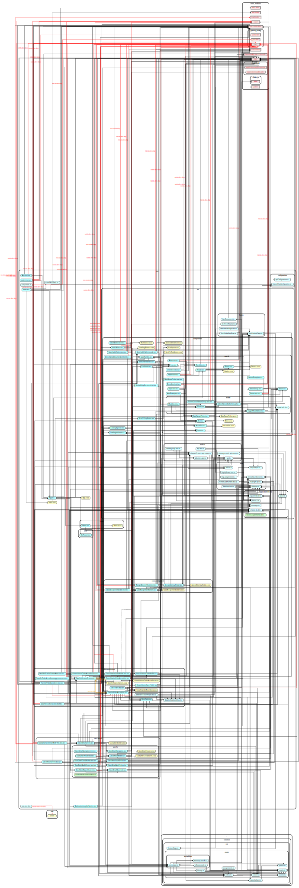
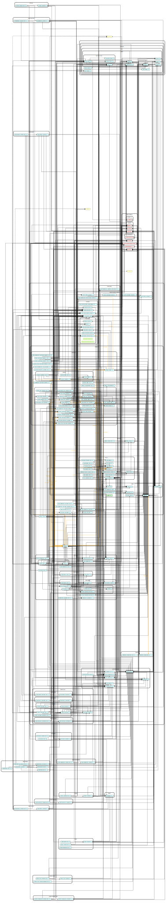

# Architecture

The CAMS development team follows the Option-enabling Software Architecture (OeSA) approach to defining the system architecture. We won't try to define everything here, but there are some major points that will should be covered briefly.

## Screaming Architecture

OeSA holds that the architecture of a system should _scream_ what it is rather than what technology most heavily influenced it. So the directory structure for our frontend should not look more like a React.js app than it does a bankruptcy case management system. Likewise our backend should not look more like a Node.js app or an Azure Functions App than it does a bankruptcy case management system.

## The Dependency Rule

More-important modules should not depend on less-important modules. We use interfaces invert our dependencies when we find that we would violate this rule.

We generate images using `dependency-cruiser` to help us identify violations of this rule.

### Frontend

### Backend

## The Good-fences Rule

Only simple data types should cross major boundaries.

## The Invasive-species Rule

We do not want third-party dependencies to permeate our code. We can limit our exposure to risk by using humble objects or adapters to ensure that the majority of our code depends on things under our control.
