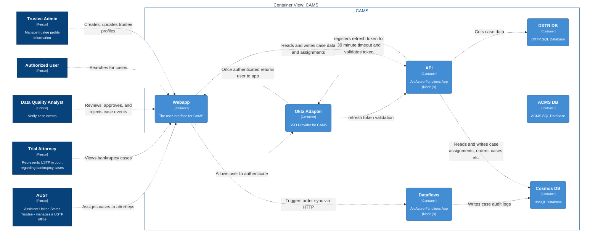

# CAMS Containers

```mermaid
graph TB
  linkStyle default fill:#ffffff

  subgraph diagram ["Container View: CAMS"]
    style diagram fill:#ffffff,stroke:#ffffff

    1["<div style='font-weight: bold'>AUST</div><div style='font-size: 70%; margin-top: 0px'>[Person]</div><div style='font-size: 80%; margin-top:10px'>Assistant United States<br />Trustee - manages a USTP<br />office</div>"]
    style 1 fill:#08427b,stroke:#052e56,color:#ffffff
    2["<div style='font-weight: bold'>Trial Attorney</div><div style='font-size: 70%; margin-top: 0px'>[Person]</div><div style='font-size: 80%; margin-top:10px'>Represents USTP in court<br />regarding bankruptcy cases</div>"]
    style 2 fill:#08427b,stroke:#052e56,color:#ffffff
    3["<div style='font-weight: bold'>Data Quality Analyst</div><div style='font-size: 70%; margin-top: 0px'>[Person]</div><div style='font-size: 80%; margin-top:10px'>Verify case events</div>"]
    style 3 fill:#08427b,stroke:#052e56,color:#ffffff
    4["<div style='font-weight: bold'>Trustee Admin</div><div style='font-size: 70%; margin-top: 0px'>[Person]</div><div style='font-size: 80%; margin-top:10px'>Manage trustee profile<br />information</div>"]
    style 4 fill:#08427b,stroke:#052e56,color:#ffffff
    5["<div style='font-weight: bold'>Authorized User</div><div style='font-size: 70%; margin-top: 0px'>[Person]</div>"]
    style 5 fill:#08427b,stroke:#052e56,color:#ffffff

    subgraph 6 ["CAMS"]
      style 6 fill:#ffffff,stroke:#0b4884,color:#0b4884

      10("<div style='font-weight: bold'>Webapp</div><div style='font-size: 70%; margin-top: 0px'>[Container]</div><div style='font-size: 80%; margin-top:10px'>The user interface for CAMS</div>")
      style 10 fill:#438dd5,stroke:#2e6295,color:#ffffff
      17("<div style='font-weight: bold'>API</div><div style='font-size: 70%; margin-top: 0px'>[Container]</div><div style='font-size: 80%; margin-top:10px'>An Azure Functions App<br />(Node.js)</div>")
      style 17 fill:#438dd5,stroke:#2e6295,color:#ffffff
      34("<div style='font-weight: bold'>Dataflows</div><div style='font-size: 70%; margin-top: 0px'>[Container]</div><div style='font-size: 80%; margin-top:10px'>An Azure Functions App<br />(Node.js)</div>")
      style 34 fill:#438dd5,stroke:#2e6295,color:#ffffff
      39("<div style='font-weight: bold'>DXTR DB</div><div style='font-size: 70%; margin-top: 0px'>[Container]</div><div style='font-size: 80%; margin-top:10px'>DXTR SQL Database</div>")
      style 39 fill:#438dd5,stroke:#2e6295,color:#ffffff
      40("<div style='font-weight: bold'>ACMS DB</div><div style='font-size: 70%; margin-top: 0px'>[Container]</div><div style='font-size: 80%; margin-top:10px'>ACMS SQL Database</div>")
      style 40 fill:#438dd5,stroke:#2e6295,color:#ffffff
      41("<div style='font-weight: bold'>Cosmos DB</div><div style='font-size: 70%; margin-top: 0px'>[Container]</div><div style='font-size: 80%; margin-top:10px'>NoSQL Database</div>")
      style 41 fill:#438dd5,stroke:#2e6295,color:#ffffff
      7("<div style='font-weight: bold'>Okta Adapter</div><div style='font-size: 70%; margin-top: 0px'>[Container]</div><div style='font-size: 80%; margin-top:10px'>SSO Provider for CAMS</div>")
      style 7 fill:#438dd5,stroke:#2e6295,color:#ffffff
    end

    34-. "<div>Writes case audit logs</div><div style='font-size: 70%'></div>" .->41
    1-. "<div>Assigns cases to attorneys</div><div style='font-size: 70%'></div>" .->10
    2-. "<div>Views bankruptcy cases</div><div style='font-size: 70%'></div>" .->10
    3-. "<div>Reviews, approves, and<br />rejects case events</div><div style='font-size: 70%'></div>" .->10
    5-. "<div>Searches for cases</div><div style='font-size: 70%'></div>" .->10
    4-. "<div>Creates, updates trustee<br />profiles</div><div style='font-size: 70%'></div>" .->10
    10-. "<div>Allows user to authenticate</div><div style='font-size: 70%'></div>" .->7
    7-. "<div>Once authenticated returns<br />user to app</div><div style='font-size: 70%'></div>" .->10
    17-. "<div>registers refresh token for<br />30 minute timeout and<br />validates token</div><div style='font-size: 70%'></div>" .->7
    7-. "<div>refresh token validation</div><div style='font-size: 70%'></div>" .->17
    10-. "<div>Reads and writes case data<br />and assignments</div><div style='font-size: 70%'></div>" .->17
    10-. "<div>Triggers order sync via HTTP</div><div style='font-size: 70%'></div>" .->34
    17-. "<div>Reads and writes case<br />assignments, orders, cases,<br />etc.</div><div style='font-size: 70%'></div>" .->41
    17-. "<div>Gets case data</div><div style='font-size: 70%'></div>" .->39

  end
```
