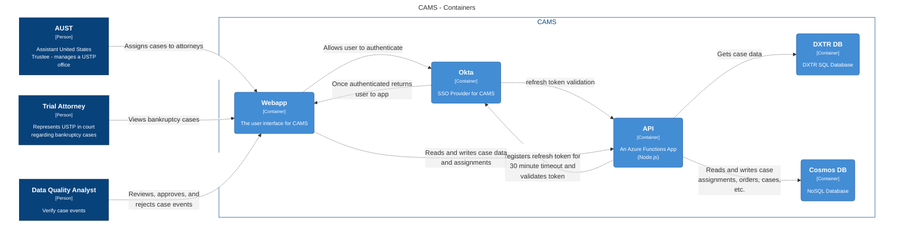

# CAMS Containers

```mermaid
graph TB
  linkStyle default fill:#ffffff

  subgraph diagram ["CAMS - Containers"]
    style diagram fill:#ffffff,stroke:#ffffff

    1["<div style='font-weight: bold'>AUST</div><div style='font-size: 70%; margin-top: 0px'>[Person]</div><div style='font-size: 80%; margin-top:10px'>Assistant United States<br />Trustee - manages a USTP<br />office</div>"]
    style 1 fill:#08427b,stroke:#052e56,color:#ffffff
    2["<div style='font-weight: bold'>Trial Attorney</div><div style='font-size: 70%; margin-top: 0px'>[Person]</div><div style='font-size: 80%; margin-top:10px'>Represents USTP in court<br />regarding bankruptcy cases</div>"]
    style 2 fill:#08427b,stroke:#052e56,color:#ffffff
    3["<div style='font-weight: bold'>Data Quality Analyst</div><div style='font-size: 70%; margin-top: 0px'>[Person]</div><div style='font-size: 80%; margin-top:10px'>Verify case events</div>"]
    style 3 fill:#08427b,stroke:#052e56,color:#ffffff

    subgraph 4 [CAMS]
      style 4 fill:#ffffff,stroke:#0b4884,color:#0b4884

      12("<div style='font-weight: bold'>API</div><div style='font-size: 70%; margin-top: 0px'>[Container]</div><div style='font-size: 80%; margin-top:10px'>An Azure Functions App<br />(Node.js)</div>")
      style 12 fill:#438dd5,stroke:#2e6295,color:#ffffff
      26("<div style='font-weight: bold'>DXTR DB</div><div style='font-size: 70%; margin-top: 0px'>[Container]</div><div style='font-size: 80%; margin-top:10px'>DXTR SQL Database</div>")
      style 26 fill:#438dd5,stroke:#2e6295,color:#ffffff
      27("<div style='font-weight: bold'>Cosmos DB</div><div style='font-size: 70%; margin-top: 0px'>[Container]</div><div style='font-size: 80%; margin-top:10px'>NoSQL Database</div>")
      style 27 fill:#438dd5,stroke:#2e6295,color:#ffffff
      5("<div style='font-weight: bold'>Okta</div><div style='font-size: 70%; margin-top: 0px'>[Container]</div><div style='font-size: 80%; margin-top:10px'>SSO Provider for CAMS</div>")
      style 5 fill:#438dd5,stroke:#2e6295,color:#ffffff
      8("<div style='font-weight: bold'>Webapp</div><div style='font-size: 70%; margin-top: 0px'>[Container]</div><div style='font-size: 80%; margin-top:10px'>The user interface for CAMS</div>")
      style 8 fill:#438dd5,stroke:#2e6295,color:#ffffff
    end

    1-. "<div>Assigns cases to attorneys</div><div style='font-size: 70%'></div>" .->8
    2-. "<div>Views bankruptcy cases</div><div style='font-size: 70%'></div>" .->8
    3-. "<div>Reviews, approves, and<br />rejects case events</div><div style='font-size: 70%'></div>" .->8
    8-. "<div>Allows user to authenticate</div><div style='font-size: 70%'></div>" .->5
    5-. "<div>Once authenticated returns<br />user to app</div><div style='font-size: 70%'></div>" .->8
    12-. "<div>registers refresh token for<br />30 minute timeout and<br />validates token</div><div style='font-size: 70%'></div>" .->5
    5-. "<div>refresh token validation</div><div style='font-size: 70%'></div>" .->12
    8-. "<div>Reads and writes case data<br />and assignments</div><div style='font-size: 70%'></div>" .->12
    12-. "<div>Reads and writes case<br />assignments, orders, cases,<br />etc.</div><div style='font-size: 70%'></div>" .->27
    12-. "<div>Gets case data</div><div style='font-size: 70%'></div>" .->26
  end
```
