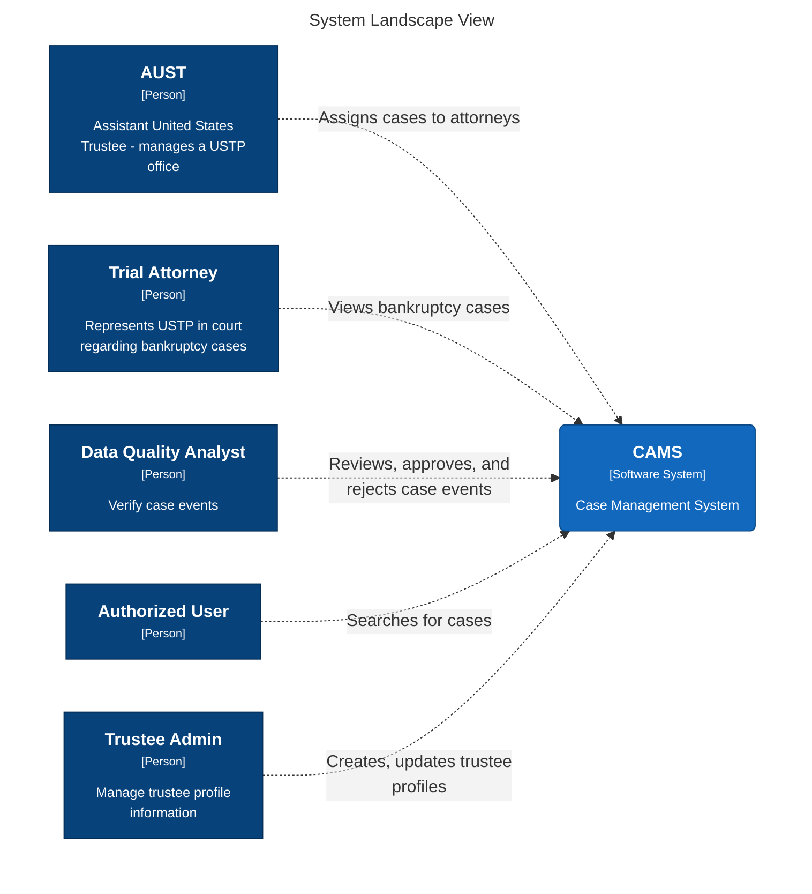

# CAMS System Context

```mermaid
graph TB
  linkStyle default fill:#ffffff

  subgraph diagram ["System Landscape View"]
    style diagram fill:#ffffff,stroke:#ffffff

    1["<div style='font-weight: bold'>AUST</div><div style='font-size: 70%; margin-top: 0px'>[Person]</div><div style='font-size: 80%; margin-top:10px'>Assistant United States<br />Trustee - manages a USTP<br />office</div>"]
    style 1 fill:#08427b,stroke:#052e56,color:#ffffff
    2["<div style='font-weight: bold'>Trial Attorney</div><div style='font-size: 70%; margin-top: 0px'>[Person]</div><div style='font-size: 80%; margin-top:10px'>Represents USTP in court<br />regarding bankruptcy cases</div>"]
    style 2 fill:#08427b,stroke:#052e56,color:#ffffff
    3["<div style='font-weight: bold'>Data Quality Analyst</div><div style='font-size: 70%; margin-top: 0px'>[Person]</div><div style='font-size: 80%; margin-top:10px'>Verify case events</div>"]
    style 3 fill:#08427b,stroke:#052e56,color:#ffffff
    4["<div style='font-weight: bold'>Trustee Admin</div><div style='font-size: 70%; margin-top: 0px'>[Person]</div><div style='font-size: 80%; margin-top:10px'>Manage trustee profile<br />information</div>"]
    style 4 fill:#08427b,stroke:#052e56,color:#ffffff
    5["<div style='font-weight: bold'>Authorized User</div><div style='font-size: 70%; margin-top: 0px'>[Person]</div>"]
    style 5 fill:#08427b,stroke:#052e56,color:#ffffff
    6("<div style='font-weight: bold'>CAMS</div><div style='font-size: 70%; margin-top: 0px'>[Software System]</div><div style='font-size: 80%; margin-top:10px'>Case Management System</div>")
    style 6 fill:#1168bd,stroke:#0b4884,color:#ffffff

    1-. "<div>Assigns cases to attorneys</div><div style='font-size: 70%'></div>" .->6
    2-. "<div>Views bankruptcy cases</div><div style='font-size: 70%'></div>" .->6
    3-. "<div>Reviews, approves, and<br />rejects case events</div><div style='font-size: 70%'></div>" .->6
    5-. "<div>Searches for cases</div><div style='font-size: 70%'></div>" .->6
    4-. "<div>Creates, updates trustee<br />profiles</div><div style='font-size: 70%'></div>" .->6

  end
```
