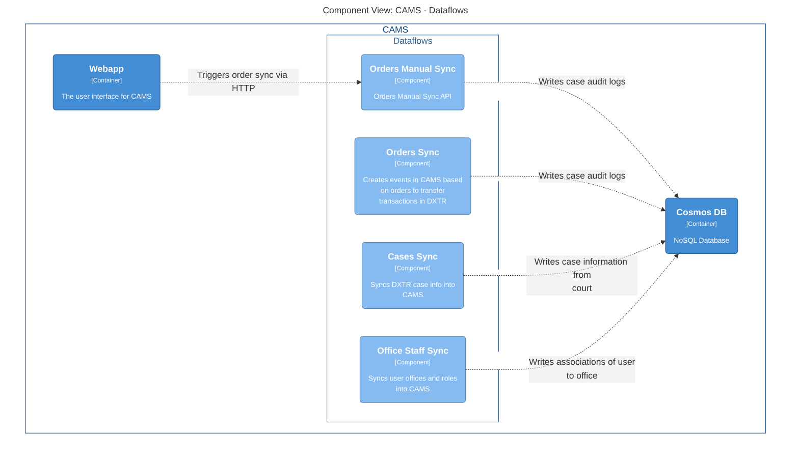

# CAMS Dataflows Components

```mermaid
graph TB
  linkStyle default fill:#ffffff

  subgraph diagram ["Component View: CAMS - Dataflows"]
    style diagram fill:#ffffff,stroke:#ffffff

    subgraph 6 ["CAMS"]
      style 6 fill:#ffffff,stroke:#0b4884,color:#0b4884

      subgraph 34 ["Dataflows"]
        style 34 fill:#ffffff,stroke:#2e6295,color:#2e6295

        35("<div style='font-weight: bold'>Cases Sync</div><div style='font-size: 70%; margin-top: 0px'>[Component]</div><div style='font-size: 80%; margin-top:10px'>Syncs DXTR case info into<br />CAMS</div>")
        style 35 fill:#85bbf0,stroke:#5d82a8,color:#ffffff
        36("<div style='font-weight: bold'>Office Staff Sync</div><div style='font-size: 70%; margin-top: 0px'>[Component]</div><div style='font-size: 80%; margin-top:10px'>Syncs user offices and roles<br />into CAMS</div>")
        style 36 fill:#85bbf0,stroke:#5d82a8,color:#ffffff
        37("<div style='font-weight: bold'>Orders Manual Sync</div><div style='font-size: 70%; margin-top: 0px'>[Component]</div><div style='font-size: 80%; margin-top:10px'>Orders Manual Sync API</div>")
        style 37 fill:#85bbf0,stroke:#5d82a8,color:#ffffff
        38("<div style='font-weight: bold'>Orders Sync</div><div style='font-size: 70%; margin-top: 0px'>[Component]</div><div style='font-size: 80%; margin-top:10px'>Creates events in CAMS based<br />on orders to transfer<br />transactions in DXTR</div>")
        style 38 fill:#85bbf0,stroke:#5d82a8,color:#ffffff
      end

      10("<div style='font-weight: bold'>Webapp</div><div style='font-size: 70%; margin-top: 0px'>[Container]</div><div style='font-size: 80%; margin-top:10px'>The user interface for CAMS</div>")
      style 10 fill:#438dd5,stroke:#2e6295,color:#ffffff
      41("<div style='font-weight: bold'>Cosmos DB</div><div style='font-size: 70%; margin-top: 0px'>[Container]</div><div style='font-size: 80%; margin-top:10px'>NoSQL Database</div>")
      style 41 fill:#438dd5,stroke:#2e6295,color:#ffffff
    end

    37-. "<div>Writes case audit logs</div><div style='font-size: 70%'></div>" .->41
    38-. "<div>Writes case audit logs</div><div style='font-size: 70%'></div>" .->41
    35-. "<div>Writes case information from<br />court</div><div style='font-size: 70%'></div>" .->41
    36-. "<div>Writes associations of user<br />to office</div><div style='font-size: 70%'></div>" .->41
    10-. "<div>Triggers order sync via HTTP</div><div style='font-size: 70%'></div>" .->37

  end
```
