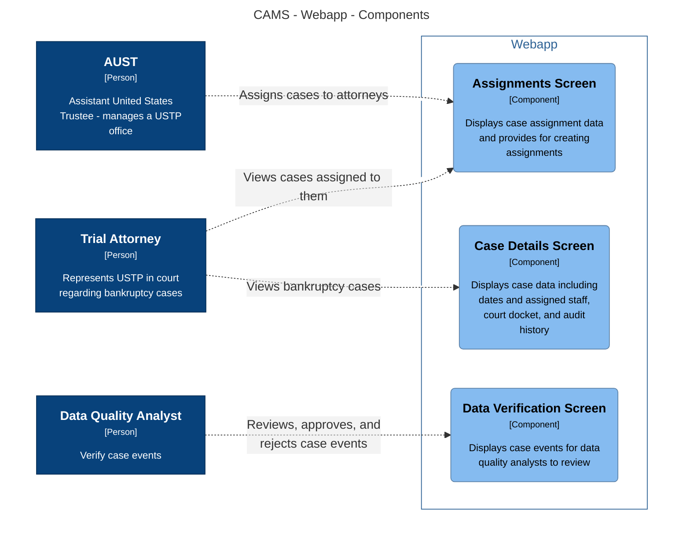

# CAMS Webapp Components

```mermaid
graph TB
  linkStyle default fill:#ffffff

  subgraph diagram ["CAMS - Webapp - Components"]
    style diagram fill:#ffffff,stroke:#ffffff

    1["<div style='font-weight: bold'>AUST</div><div style='font-size: 70%; margin-top: 0px'>[Person]</div><div style='font-size: 80%; margin-top:10px'>Assistant United States<br />Trustee - manages a USTP<br />office</div>"]
    style 1 fill:#08427b,stroke:#052e56,color:#ffffff
    2["<div style='font-weight: bold'>Trial Attorney</div><div style='font-size: 70%; margin-top: 0px'>[Person]</div><div style='font-size: 80%; margin-top:10px'>Represents USTP in court<br />regarding bankruptcy cases</div>"]
    style 2 fill:#08427b,stroke:#052e56,color:#ffffff
    3["<div style='font-weight: bold'>Data Quality Analyst</div><div style='font-size: 70%; margin-top: 0px'>[Person]</div><div style='font-size: 80%; margin-top:10px'>Verify case events</div>"]
    style 3 fill:#08427b,stroke:#052e56,color:#ffffff

    subgraph 8 [Webapp]
      style 8 fill:#ffffff,stroke:#2e6295,color:#2e6295

      10("<div style='font-weight: bold'>Case Details Screen</div><div style='font-size: 70%; margin-top: 0px'>[Component]</div><div style='font-size: 80%; margin-top:10px'>Displays case data including<br />dates and assigned staff,<br />court docket, and audit<br />history</div>")
      style 10 fill:#85bbf0,stroke:#5d82a8,color:#000000
      11("<div style='font-weight: bold'>Data Verification Screen</div><div style='font-size: 70%; margin-top: 0px'>[Component]</div><div style='font-size: 80%; margin-top:10px'>Displays case events for data<br />quality analysts to review</div>")
      style 11 fill:#85bbf0,stroke:#5d82a8,color:#000000
      9("<div style='font-weight: bold'>Assignments Screen</div><div style='font-size: 70%; margin-top: 0px'>[Component]</div><div style='font-size: 80%; margin-top:10px'>Displays case assignment data<br />and provides for creating<br />assignments</div>")
      style 9 fill:#85bbf0,stroke:#5d82a8,color:#000000
    end

    2-. "<div>Views bankruptcy cases</div><div style='font-size: 70%'></div>" .->10
    1-. "<div>Assigns cases to attorneys</div><div style='font-size: 70%'></div>" .->9
    2-. "<div>Views cases assigned to them</div><div style='font-size: 70%'></div>" .->9
    3-. "<div>Reviews, approves, and<br />rejects case events</div><div style='font-size: 70%'></div>" .->11
  end
```
