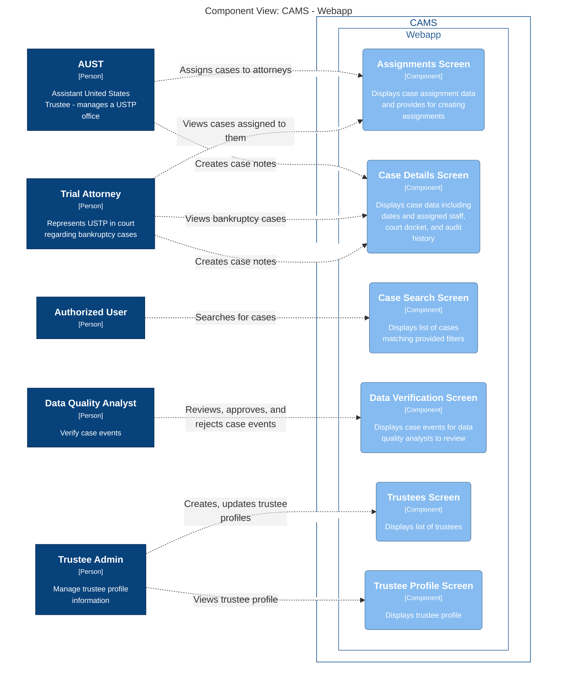

# CAMS Webapp Components

```mermaid
graph TB
  linkStyle default fill:#ffffff

  subgraph diagram ["Component View: CAMS - Webapp"]
    style diagram fill:#ffffff,stroke:#ffffff

    1["<div style='font-weight: bold'>AUST</div><div style='font-size: 70%; margin-top: 0px'>[Person]</div><div style='font-size: 80%; margin-top:10px'>Assistant United States<br />Trustee - manages a USTP<br />office</div>"]
    style 1 fill:#08427b,stroke:#052e56,color:#ffffff
    2["<div style='font-weight: bold'>Trial Attorney</div><div style='font-size: 70%; margin-top: 0px'>[Person]</div><div style='font-size: 80%; margin-top:10px'>Represents USTP in court<br />regarding bankruptcy cases</div>"]
    style 2 fill:#08427b,stroke:#052e56,color:#ffffff
    3["<div style='font-weight: bold'>Data Quality Analyst</div><div style='font-size: 70%; margin-top: 0px'>[Person]</div><div style='font-size: 80%; margin-top:10px'>Verify case events</div>"]
    style 3 fill:#08427b,stroke:#052e56,color:#ffffff
    4["<div style='font-weight: bold'>Trustee Admin</div><div style='font-size: 70%; margin-top: 0px'>[Person]</div><div style='font-size: 80%; margin-top:10px'>Manage trustee profile<br />information</div>"]
    style 4 fill:#08427b,stroke:#052e56,color:#ffffff
    5["<div style='font-weight: bold'>Authorized User</div><div style='font-size: 70%; margin-top: 0px'>[Person]</div>"]
    style 5 fill:#08427b,stroke:#052e56,color:#ffffff

    subgraph 6 ["CAMS"]
      style 6 fill:#ffffff,stroke:#0b4884,color:#0b4884

      subgraph 10 ["Webapp"]
        style 10 fill:#ffffff,stroke:#2e6295,color:#2e6295

        11("<div style='font-weight: bold'>Assignments Screen</div><div style='font-size: 70%; margin-top: 0px'>[Component]</div><div style='font-size: 80%; margin-top:10px'>Displays case assignment data<br />and provides for creating<br />assignments</div>")
        style 11 fill:#85bbf0,stroke:#5d82a8,color:#ffffff
        12("<div style='font-weight: bold'>Case Details Screen</div><div style='font-size: 70%; margin-top: 0px'>[Component]</div><div style='font-size: 80%; margin-top:10px'>Displays case data including<br />dates and assigned staff,<br />court docket, and audit<br />history</div>")
        style 12 fill:#85bbf0,stroke:#5d82a8,color:#ffffff
        13("<div style='font-weight: bold'>Case Search Screen</div><div style='font-size: 70%; margin-top: 0px'>[Component]</div><div style='font-size: 80%; margin-top:10px'>Displays list of cases<br />matching provided filters</div>")
        style 13 fill:#85bbf0,stroke:#5d82a8,color:#ffffff
        14("<div style='font-weight: bold'>Data Verification Screen</div><div style='font-size: 70%; margin-top: 0px'>[Component]</div><div style='font-size: 80%; margin-top:10px'>Displays case events for data<br />quality analysts to review</div>")
        style 14 fill:#85bbf0,stroke:#5d82a8,color:#ffffff
        15("<div style='font-weight: bold'>Trustees Screen</div><div style='font-size: 70%; margin-top: 0px'>[Component]</div><div style='font-size: 80%; margin-top:10px'>Displays list of trustees</div>")
        style 15 fill:#85bbf0,stroke:#5d82a8,color:#ffffff
        16("<div style='font-weight: bold'>Trustee Profile Screen</div><div style='font-size: 70%; margin-top: 0px'>[Component]</div><div style='font-size: 80%; margin-top:10px'>Displays trustee profile</div>")
        style 16 fill:#85bbf0,stroke:#5d82a8,color:#ffffff
      end

    end

    1-. "<div>Creates case notes</div><div style='font-size: 70%'></div>" .->12
    2-. "<div>Views bankruptcy cases</div><div style='font-size: 70%'></div>" .->12
    2-. "<div>Creates case notes</div><div style='font-size: 70%'></div>" .->12
    1-. "<div>Assigns cases to attorneys</div><div style='font-size: 70%'></div>" .->11
    2-. "<div>Views cases assigned to them</div><div style='font-size: 70%'></div>" .->11
    3-. "<div>Reviews, approves, and<br />rejects case events</div><div style='font-size: 70%'></div>" .->14
    5-. "<div>Searches for cases</div><div style='font-size: 70%'></div>" .->13
    4-. "<div>Creates, updates trustee<br />profiles</div><div style='font-size: 70%'></div>" .->15
    4-. "<div>Views trustee profile</div><div style='font-size: 70%'></div>" .->16

  end
```
