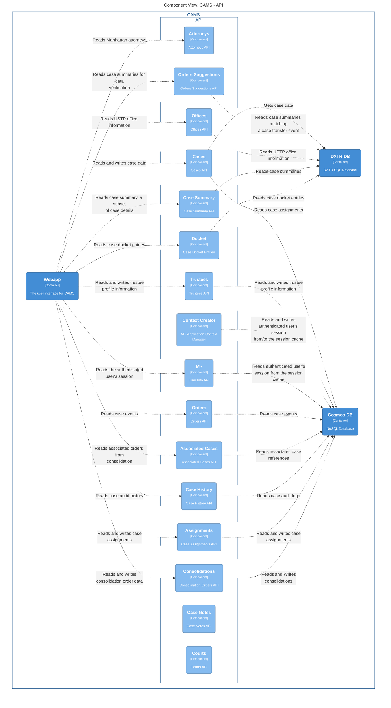

# CAMS Webapp with Functions API

```mermaid
graph TB
  linkStyle default fill:#ffffff

  subgraph diagram ["Component View: CAMS - API"]
    style diagram fill:#ffffff,stroke:#ffffff

    subgraph 6 ["CAMS"]
      style 6 fill:#ffffff,stroke:#0b4884,color:#0b4884

      subgraph 17 ["API"]
        style 17 fill:#ffffff,stroke:#2e6295,color:#2e6295

        18("<div style='font-weight: bold'>Attorneys</div><div style='font-size: 70%; margin-top: 0px'>[Component]</div><div style='font-size: 80%; margin-top:10px'>Attorneys API</div>")
        style 18 fill:#85bbf0,stroke:#5d82a8,color:#ffffff
        19("<div style='font-weight: bold'>Cases</div><div style='font-size: 70%; margin-top: 0px'>[Component]</div><div style='font-size: 80%; margin-top:10px'>Cases API</div>")
        style 19 fill:#85bbf0,stroke:#5d82a8,color:#ffffff
        20("<div style='font-weight: bold'>Assignments</div><div style='font-size: 70%; margin-top: 0px'>[Component]</div><div style='font-size: 80%; margin-top:10px'>Case Assignments API</div>")
        style 20 fill:#85bbf0,stroke:#5d82a8,color:#ffffff
        21("<div style='font-weight: bold'>Docket</div><div style='font-size: 70%; margin-top: 0px'>[Component]</div><div style='font-size: 80%; margin-top:10px'>Case Docket Entries</div>")
        style 21 fill:#85bbf0,stroke:#5d82a8,color:#ffffff
        22("<div style='font-weight: bold'>Case History</div><div style='font-size: 70%; margin-top: 0px'>[Component]</div><div style='font-size: 80%; margin-top:10px'>Case History API</div>")
        style 22 fill:#85bbf0,stroke:#5d82a8,color:#ffffff
        23("<div style='font-weight: bold'>Case Summary</div><div style='font-size: 70%; margin-top: 0px'>[Component]</div><div style='font-size: 80%; margin-top:10px'>Case Summary API</div>")
        style 23 fill:#85bbf0,stroke:#5d82a8,color:#ffffff
        24("<div style='font-weight: bold'>Offices</div><div style='font-size: 70%; margin-top: 0px'>[Component]</div><div style='font-size: 80%; margin-top:10px'>Offices API</div>")
        style 24 fill:#85bbf0,stroke:#5d82a8,color:#ffffff
        25("<div style='font-weight: bold'>Orders</div><div style='font-size: 70%; margin-top: 0px'>[Component]</div><div style='font-size: 80%; margin-top:10px'>Orders API</div>")
        style 25 fill:#85bbf0,stroke:#5d82a8,color:#ffffff
        26("<div style='font-weight: bold'>Orders Suggestions</div><div style='font-size: 70%; margin-top: 0px'>[Component]</div><div style='font-size: 80%; margin-top:10px'>Orders Suggestions API</div>")
        style 26 fill:#85bbf0,stroke:#5d82a8,color:#ffffff
        27("<div style='font-weight: bold'>Consolidations</div><div style='font-size: 70%; margin-top: 0px'>[Component]</div><div style='font-size: 80%; margin-top:10px'>Consolidation Orders API</div>")
        style 27 fill:#85bbf0,stroke:#5d82a8,color:#ffffff
        28("<div style='font-weight: bold'>Associated Cases</div><div style='font-size: 70%; margin-top: 0px'>[Component]</div><div style='font-size: 80%; margin-top:10px'>Associated Cases API</div>")
        style 28 fill:#85bbf0,stroke:#5d82a8,color:#ffffff
        29("<div style='font-weight: bold'>Me</div><div style='font-size: 70%; margin-top: 0px'>[Component]</div><div style='font-size: 80%; margin-top:10px'>User Info API</div>")
        style 29 fill:#85bbf0,stroke:#5d82a8,color:#ffffff
        30("<div style='font-weight: bold'>Context Creator</div><div style='font-size: 70%; margin-top: 0px'>[Component]</div><div style='font-size: 80%; margin-top:10px'>API Application Context<br />Manager</div>")
        style 30 fill:#85bbf0,stroke:#5d82a8,color:#ffffff
        31("<div style='font-weight: bold'>Trustees</div><div style='font-size: 70%; margin-top: 0px'>[Component]</div><div style='font-size: 80%; margin-top:10px'>Trustees API</div>")
        style 31 fill:#85bbf0,stroke:#5d82a8,color:#ffffff
        32("<div style='font-weight: bold'>Case Notes</div><div style='font-size: 70%; margin-top: 0px'>[Component]</div><div style='font-size: 80%; margin-top:10px'>Case Notes API</div>")
        style 32 fill:#85bbf0,stroke:#5d82a8,color:#ffffff
        33("<div style='font-weight: bold'>Courts</div><div style='font-size: 70%; margin-top: 0px'>[Component]</div><div style='font-size: 80%; margin-top:10px'>Courts API</div>")
        style 33 fill:#85bbf0,stroke:#5d82a8,color:#ffffff
      end

      10("<div style='font-weight: bold'>Webapp</div><div style='font-size: 70%; margin-top: 0px'>[Container]</div><div style='font-size: 80%; margin-top:10px'>The user interface for CAMS</div>")
      style 10 fill:#438dd5,stroke:#2e6295,color:#ffffff
      39("<div style='font-weight: bold'>DXTR DB</div><div style='font-size: 70%; margin-top: 0px'>[Container]</div><div style='font-size: 80%; margin-top:10px'>DXTR SQL Database</div>")
      style 39 fill:#438dd5,stroke:#2e6295,color:#ffffff
      41("<div style='font-weight: bold'>Cosmos DB</div><div style='font-size: 70%; margin-top: 0px'>[Container]</div><div style='font-size: 80%; margin-top:10px'>NoSQL Database</div>")
      style 41 fill:#438dd5,stroke:#2e6295,color:#ffffff
    end

    27-. "<div>Reads and Writes<br />consolidations</div><div style='font-size: 70%'></div>" .->41
    20-. "<div>Reads and writes case<br />assignments</div><div style='font-size: 70%'></div>" .->41
    21-. "<div>Reads case docket entries</div><div style='font-size: 70%'></div>" .->39
    22-. "<div>Reads case audit logs</div><div style='font-size: 70%'></div>" .->41
    23-. "<div>Reads case summaries</div><div style='font-size: 70%'></div>" .->39
    28-. "<div>Reads associated case<br />references</div><div style='font-size: 70%'></div>" .->41
    24-. "<div>Reads USTP office information</div><div style='font-size: 70%'></div>" .->39
    25-. "<div>Reads case events</div><div style='font-size: 70%'></div>" .->41
    26-. "<div>Reads case summaries matching<br />a case transfer event</div><div style='font-size: 70%'></div>" .->39
    29-. "<div>Reads authenticated user's<br />session from the session<br />cache</div><div style='font-size: 70%'></div>" .->41
    30-. "<div>Reads and writes<br />authenticated user's session<br />from/to the session cache</div><div style='font-size: 70%'></div>" .->41
    31-. "<div>Reads and writes trustee<br />profile information</div><div style='font-size: 70%'></div>" .->41
    10-. "<div>Reads and writes case data</div><div style='font-size: 70%'></div>" .->19
    10-. "<div>Reads and writes case<br />assignments</div><div style='font-size: 70%'></div>" .->20
    10-. "<div>Reads Manhattan attorneys</div><div style='font-size: 70%'></div>" .->18
    10-. "<div>Reads case docket entries</div><div style='font-size: 70%'></div>" .->21
    10-. "<div>Reads case audit history</div><div style='font-size: 70%'></div>" .->22
    10-. "<div>Reads case summary, a subset<br />of case details</div><div style='font-size: 70%'></div>" .->23
    10-. "<div>Reads USTP office information</div><div style='font-size: 70%'></div>" .->24
    10-. "<div>Reads case events</div><div style='font-size: 70%'></div>" .->25
    10-. "<div>Reads case summaries for data<br />verification</div><div style='font-size: 70%'></div>" .->26
    10-. "<div>Reads and writes<br />consolidation order data</div><div style='font-size: 70%'></div>" .->27
    10-. "<div>Reads associated orders from<br />consolidation</div><div style='font-size: 70%'></div>" .->28
    10-. "<div>Reads the authenticated<br />user's session</div><div style='font-size: 70%'></div>" .->29
    10-. "<div>Reads and writes trustee<br />profile information</div><div style='font-size: 70%'></div>" .->31
    19-. "<div>Gets case data</div><div style='font-size: 70%'></div>" .->39
    19-. "<div>Reads case assignments</div><div style='font-size: 70%'></div>" .->41

  end
```
