# GitHub Actions Workflow Analysis

## Summary
- **Total Workflows**: 22
- **Main Workflows**: 9
- **Reusable Workflows**: 13

## Legend

The diagrams use color coding to distinguish different types of workflow components:

**Triggers** - Event triggers that start workflows:
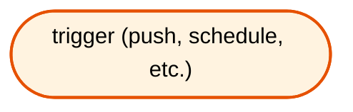

**Main Workflows** - Primary workflow files that can be triggered directly:
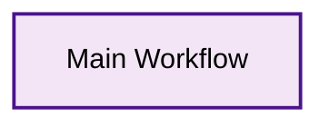

**Reusable Workflows** - Workflow files that are called by other workflows:
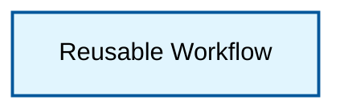

**Jobs** - Individual jobs within workflows showing internal dependencies:
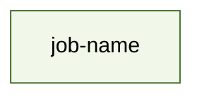


## Workflow Flow Diagrams by Trigger

### Delete Triggered Workflows

Workflows triggered by `delete`:
- **Clean up Flexion Azure Resources** (`azure-remove-branch.yml`)

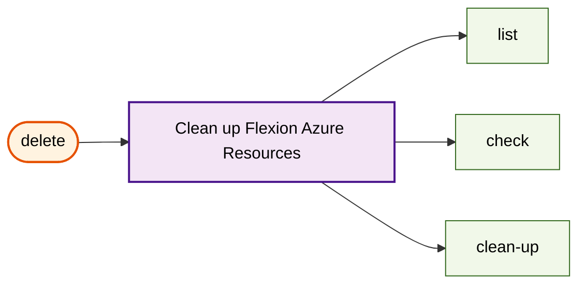

### Push Triggered Workflows

Workflows triggered by `push`:
- **Continuous Deployment** (`continuous-deployment.yml`)

```mermaid
flowchart LR
    trigger_push(["push"])
    continuous_deployment_yml["Continuous Deployment"]
    continuous_deployment_yml_setup["Setup"]
    reusable_build_info_yml["reusable-build-info.yml"]
    reusable_build_info_yml_build_info["Run Info"]
    continuous_deployment_yml_accessibility_test["accessibility-test"]
    reusable_accessibility_yml["reusable-accessibility.yml"]
    reusable_accessibility_yml_playwright_accessibility_test["playwright-accessibility-test"]
    continuous_deployment_yml_unit_test_frontend["unit-test-frontend"]
    reusable_unit_test_yml["reusable-unit-test.yml"]
    reusable_unit_test_yml_unit_test["Unit test ${{ inputs.path }}"]
    continuous_deployment_yml_unit_test_backend["unit-test-backend"]
    continuous_deployment_yml_unit_test_common["unit-test-common"]
    continuous_deployment_yml_security_scan["Security"]
    sub_security_scan_yml["Security"]
    sub_security_scan_yml_sca_scan["SCA Scan"]
    sub_security_scan_yml_sast_scan["SAST Scan"]
    continuous_deployment_yml_build["Build"]
    sub_build_yml["sub-build.yml"]
    sub_build_yml_see_slot_name["see-slot-name"]
    sub_build_yml_build_frontend_predeployment["Build Frontend Predeployment"]
    reusable_build_frontend_yml["reusable-build-frontend.yml"]
    reusable_build_frontend_yml_build_frontend["build-frontend"]
    sub_build_yml_backend["backend"]
    continuous_deployment_yml_deploy["Cloud Resource Deployment"]
    sub_deploy_yml["sub-deploy.yml"]
    sub_deploy_yml_deploy_infra["Azure Infrastructure"]
    reusable_deploy_yml["reusable-deploy.yml"]
    reusable_deploy_yml_deploy_azure_infrastructure["deploy-azure-infrastructure"]
    sub_deploy_yml_build_frontend_deployment_artifact["Build Frontend for deployment"]
    sub_deploy_yml_deploy_supporting_infrastructure["Supporting Infrastructure"]
    reusable_infrastructure_deploy_yml["reusable-infrastructure-deploy.yml"]
    reusable_infrastructure_deploy_yml_deploy_log_analytics_workspace["deploy-log-analytics-workspace"]
    reusable_infrastructure_deploy_yml_deploy_db["deploy-db"]
    continuous_deployment_yml_deploy_code_slot["Slot Code Deployment"]
    sub_deploy_code_slot_yml["sub-deploy-code-slot.yml"]
    sub_deploy_code_slot_yml_deploy_code["Slot Code Deployment"]
    sub_deploy_code_yml["sub-deploy-code.yml"]
    sub_deploy_code_yml_deploy_webapp["deploy-webapp"]
    sub_deploy_code_yml_deploy_api["deploy-api"]
    sub_deploy_code_yml_deploy_dataflows_app["deploy-dataflows-app"]
    sub_deploy_code_yml_endpoint_test_application["endpoint-test-application"]
    reusable_endpoint_test_yml["reusable-endpoint-test.yml"]
    reusable_endpoint_test_yml_endpoint_test_application["endpoint-test-application"]
    sub_deploy_code_yml_enable_access["enable-access"]
    sub_deploy_code_slot_yml_deploy_webapp_slot["deploy-webapp-slot"]
    sub_deploy_code_slot_yml_deploy_api_slot["deploy-api-slot"]
    sub_deploy_code_slot_yml_deploy_dataflows_slot["deploy-dataflows-slot"]
    sub_deploy_code_slot_yml_endpoint_test_application_slot["endpoint-test-application-slot"]
    sub_deploy_code_slot_yml_execute_e2e_test["execute-e2e-test"]
    reusable_e2e_yml["reusable-e2e.yml"]
    reusable_e2e_yml_playwright_e2e_test["playwright-e2e-test"]
    sub_deploy_code_slot_yml_swap_webapp_deployment_slot["swap-webapp-deployment-slot"]
    sub_deploy_code_slot_yml_swap_nodeapi_deployment_slot["swap-nodeapi-deployment-slot"]
    sub_deploy_code_slot_yml_swap_dataflows_app_deployment_slot["swap-dataflows-app-deployment-slot"]
    sub_deploy_code_slot_yml_endpoint_test_application_post_swap["endpoint-test-application-post-swap"]
    sub_deploy_code_slot_yml_enable_access["enable-access"]

    trigger_push --> continuous_deployment_yml
    continuous_deployment_yml --> continuous_deployment_yml_setup
    reusable_build_info_yml --> reusable_build_info_yml_build_info
    continuous_deployment_yml_setup --> reusable_build_info_yml
    continuous_deployment_yml --> continuous_deployment_yml_accessibility_test
    reusable_accessibility_yml --> reusable_accessibility_yml_playwright_accessibility_test
    continuous_deployment_yml_accessibility_test --> reusable_accessibility_yml
    continuous_deployment_yml --> continuous_deployment_yml_unit_test_frontend
    reusable_unit_test_yml --> reusable_unit_test_yml_unit_test
    continuous_deployment_yml_unit_test_frontend --> reusable_unit_test_yml
    continuous_deployment_yml --> continuous_deployment_yml_unit_test_backend
    continuous_deployment_yml_unit_test_backend --> reusable_unit_test_yml
    continuous_deployment_yml --> continuous_deployment_yml_unit_test_common
    continuous_deployment_yml_unit_test_common --> reusable_unit_test_yml
    continuous_deployment_yml --> continuous_deployment_yml_security_scan
    sub_security_scan_yml --> sub_security_scan_yml_sca_scan
    sub_security_scan_yml --> sub_security_scan_yml_sast_scan
    continuous_deployment_yml_security_scan --> sub_security_scan_yml
    continuous_deployment_yml --> continuous_deployment_yml_build
    sub_build_yml --> sub_build_yml_see_slot_name
    sub_build_yml --> sub_build_yml_build_frontend_predeployment
    reusable_build_frontend_yml --> reusable_build_frontend_yml_build_frontend
    sub_build_yml_build_frontend_predeployment --> reusable_build_frontend_yml
    sub_build_yml --> sub_build_yml_backend
    continuous_deployment_yml_build --> sub_build_yml
    continuous_deployment_yml --> continuous_deployment_yml_deploy
    sub_deploy_yml --> sub_deploy_yml_deploy_infra
    reusable_deploy_yml --> reusable_deploy_yml_deploy_azure_infrastructure
    sub_deploy_yml_deploy_infra --> reusable_deploy_yml
    sub_deploy_yml --> sub_deploy_yml_build_frontend_deployment_artifact
    sub_deploy_yml_build_frontend_deployment_artifact --> reusable_build_frontend_yml
    sub_deploy_yml --> sub_deploy_yml_deploy_supporting_infrastructure
    reusable_infrastructure_deploy_yml --> reusable_infrastructure_deploy_yml_deploy_log_analytics_workspace
    reusable_infrastructure_deploy_yml --> reusable_infrastructure_deploy_yml_deploy_db
    sub_deploy_yml_deploy_supporting_infrastructure --> reusable_infrastructure_deploy_yml
    continuous_deployment_yml_deploy --> sub_deploy_yml
    continuous_deployment_yml --> continuous_deployment_yml_deploy_code_slot
    sub_deploy_code_slot_yml --> sub_deploy_code_slot_yml_deploy_code
    sub_deploy_code_yml --> sub_deploy_code_yml_deploy_webapp
    sub_deploy_code_yml --> sub_deploy_code_yml_deploy_api
    sub_deploy_code_yml --> sub_deploy_code_yml_deploy_dataflows_app
    sub_deploy_code_yml --> sub_deploy_code_yml_endpoint_test_application
    reusable_endpoint_test_yml --> reusable_endpoint_test_yml_endpoint_test_application
    sub_deploy_code_yml_endpoint_test_application --> reusable_endpoint_test_yml
    sub_deploy_code_yml --> sub_deploy_code_yml_enable_access
    sub_deploy_code_slot_yml_deploy_code --> sub_deploy_code_yml
    sub_deploy_code_slot_yml --> sub_deploy_code_slot_yml_deploy_webapp_slot
    sub_deploy_code_slot_yml --> sub_deploy_code_slot_yml_deploy_api_slot
    sub_deploy_code_slot_yml --> sub_deploy_code_slot_yml_deploy_dataflows_slot
    sub_deploy_code_slot_yml --> sub_deploy_code_slot_yml_endpoint_test_application_slot
    sub_deploy_code_slot_yml_endpoint_test_application_slot --> reusable_endpoint_test_yml
    sub_deploy_code_slot_yml --> sub_deploy_code_slot_yml_execute_e2e_test
    reusable_e2e_yml --> reusable_e2e_yml_playwright_e2e_test
    sub_deploy_code_slot_yml_execute_e2e_test --> reusable_e2e_yml
    sub_deploy_code_slot_yml --> sub_deploy_code_slot_yml_swap_webapp_deployment_slot
    sub_deploy_code_slot_yml --> sub_deploy_code_slot_yml_swap_nodeapi_deployment_slot
    sub_deploy_code_slot_yml --> sub_deploy_code_slot_yml_swap_dataflows_app_deployment_slot
    sub_deploy_code_slot_yml --> sub_deploy_code_slot_yml_endpoint_test_application_post_swap
    sub_deploy_code_slot_yml_endpoint_test_application_post_swap --> reusable_endpoint_test_yml
    sub_deploy_code_slot_yml --> sub_deploy_code_slot_yml_enable_access
    continuous_deployment_yml_deploy_code_slot --> sub_deploy_code_slot_yml

    classDef reusable fill:#e1f5fe,stroke:#01579b,stroke-width:2px,color:#000000
    classDef mainWorkflow fill:#f3e5f5,stroke:#4a148c,stroke-width:2px,color:#000000
    classDef trigger fill:#fff3e0,stroke:#e65100,stroke-width:2px,color:#000000
    classDef job fill:#f1f8e9,stroke:#33691e,stroke-width:1px,color:#000000

    class trigger_push trigger
    class continuous_deployment_yml mainWorkflow
    class continuous_deployment_yml_setup job
    class reusable_build_info_yml reusable
    class reusable_build_info_yml_build_info job
    class continuous_deployment_yml_accessibility_test job
    class reusable_accessibility_yml reusable
    class reusable_accessibility_yml_playwright_accessibility_test job
    class continuous_deployment_yml_unit_test_frontend job
    class reusable_unit_test_yml reusable
    class reusable_unit_test_yml_unit_test job
    class continuous_deployment_yml_unit_test_backend job
    class continuous_deployment_yml_unit_test_common job
    class continuous_deployment_yml_security_scan job
    class sub_security_scan_yml mainWorkflow
    class sub_security_scan_yml_sca_scan job
    class sub_security_scan_yml_sast_scan job
    class continuous_deployment_yml_build job
    class sub_build_yml reusable
    class sub_build_yml_see_slot_name job
    class sub_build_yml_build_frontend_predeployment job
    class reusable_build_frontend_yml reusable
    class reusable_build_frontend_yml_build_frontend job
    class sub_build_yml_backend job
    class continuous_deployment_yml_deploy job
    class sub_deploy_yml reusable
    class sub_deploy_yml_deploy_infra job
    class reusable_deploy_yml reusable
    class reusable_deploy_yml_deploy_azure_infrastructure job
    class sub_deploy_yml_build_frontend_deployment_artifact job
    class sub_deploy_yml_deploy_supporting_infrastructure job
    class reusable_infrastructure_deploy_yml reusable
    class reusable_infrastructure_deploy_yml_deploy_log_analytics_workspace job
    class reusable_infrastructure_deploy_yml_deploy_db job
    class continuous_deployment_yml_deploy_code_slot job
    class sub_deploy_code_slot_yml reusable
    class sub_deploy_code_slot_yml_deploy_code job
    class sub_deploy_code_yml reusable
    class sub_deploy_code_yml_deploy_webapp job
    class sub_deploy_code_yml_deploy_api job
    class sub_deploy_code_yml_deploy_dataflows_app job
    class sub_deploy_code_yml_endpoint_test_application job
    class reusable_endpoint_test_yml reusable
    class reusable_endpoint_test_yml_endpoint_test_application job
    class sub_deploy_code_yml_enable_access job
    class sub_deploy_code_slot_yml_deploy_webapp_slot job
    class sub_deploy_code_slot_yml_deploy_api_slot job
    class sub_deploy_code_slot_yml_deploy_dataflows_slot job
    class sub_deploy_code_slot_yml_endpoint_test_application_slot job
    class sub_deploy_code_slot_yml_execute_e2e_test job
    class reusable_e2e_yml reusable
    class reusable_e2e_yml_playwright_e2e_test job
    class sub_deploy_code_slot_yml_swap_webapp_deployment_slot job
    class sub_deploy_code_slot_yml_swap_nodeapi_deployment_slot job
    class sub_deploy_code_slot_yml_swap_dataflows_app_deployment_slot job
    class sub_deploy_code_slot_yml_endpoint_test_application_post_swap job
    class sub_deploy_code_slot_yml_enable_access job
```

##### Continuous Deployment - Job Dependencies

This diagram shows the explicit and implicit dependencies between jobs in the continuous deployment workflow:

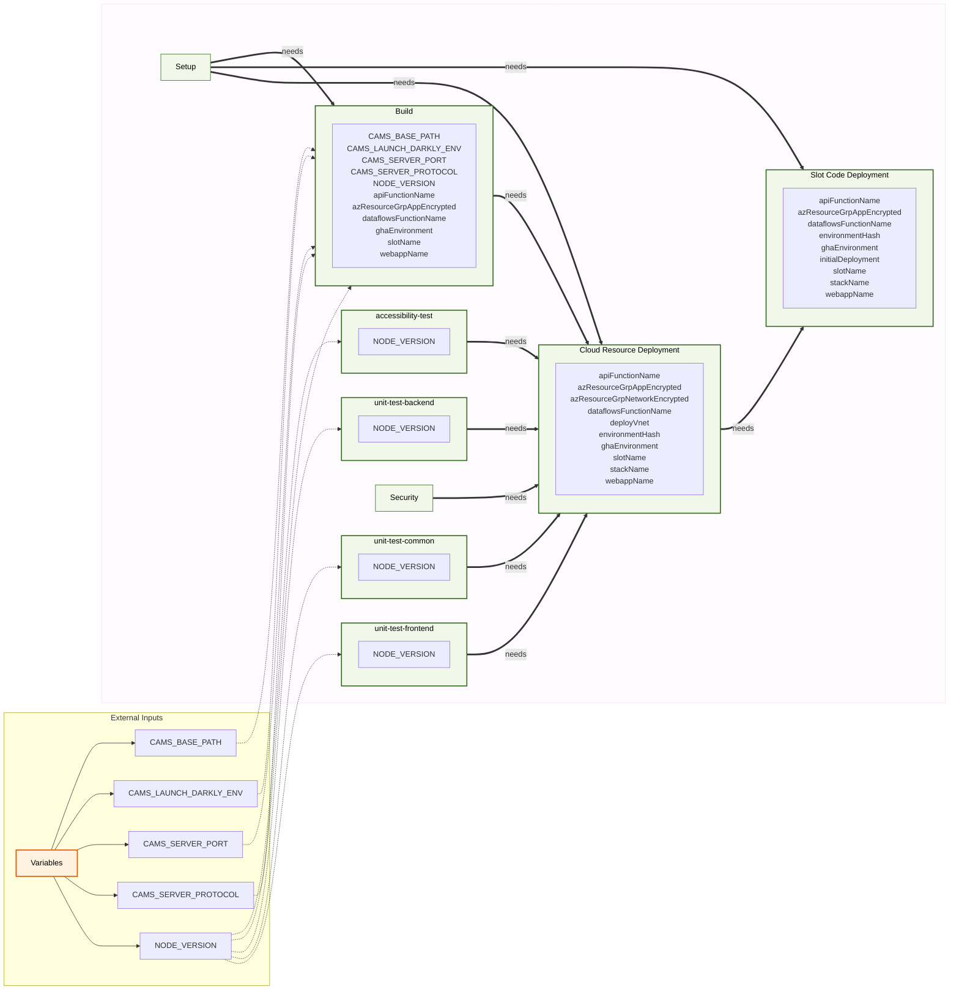

##### Deploy code for slot - Job Dependencies

This diagram shows the explicit and implicit dependencies between jobs in the deploy code for slot workflow:

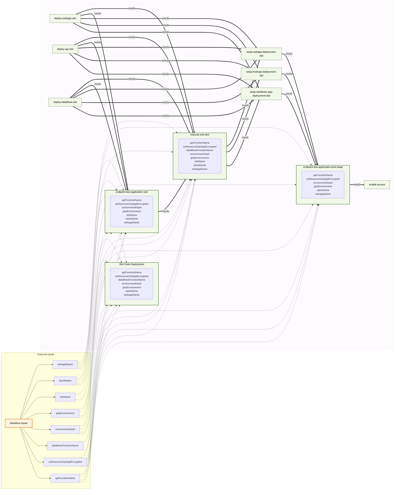

### Schedule Triggered Workflows

Workflows triggered by `schedule`:
- **Build Custom Azure CLI Runner Image** (`build-azure-cli-image.yml`)
- **Stand Alone DAST Scan** (`dast-scan.yml`)

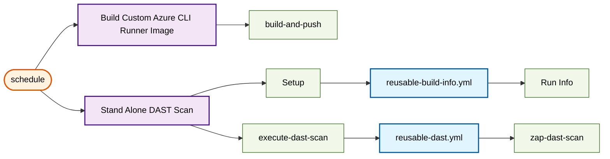

### Workflow_call Triggered Workflows

Workflows triggered by `workflow_call`:
- **Security** (`sub-security-scan.yml`)

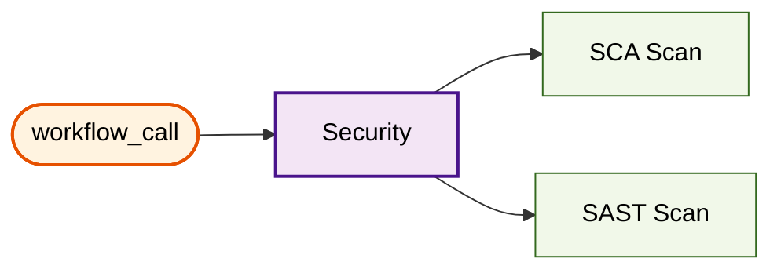

### Workflow_dispatch Triggered Workflows

The `workflow_dispatch` trigger allows manual execution of workflows. Each workflow is shown individually below:

#### Clean up Flexion Azure Resources

Manual execution of `azure-remove-branch.yml`

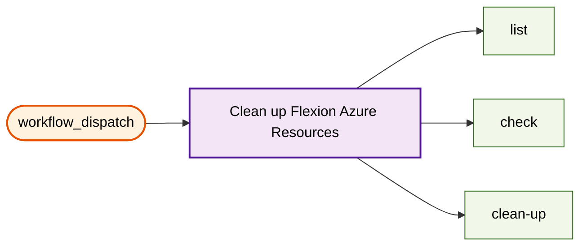

#### Build Custom Azure CLI Runner Image

Manual execution of `build-azure-cli-image.yml`

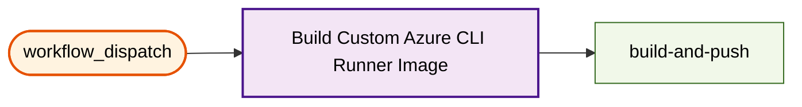

#### Continuous Deployment

Manual execution of `continuous-deployment.yml`

```mermaid
flowchart LR
    trigger_workflow_dispatch(["workflow_dispatch"])
    continuous_deployment_yml["Continuous Deployment"]
    continuous_deployment_yml_setup["Setup"]
    reusable_build_info_yml["reusable-build-info.yml"]
    reusable_build_info_yml_build_info["Run Info"]
    continuous_deployment_yml_accessibility_test["accessibility-test"]
    reusable_accessibility_yml["reusable-accessibility.yml"]
    reusable_accessibility_yml_playwright_accessibility_test["playwright-accessibility-test"]
    continuous_deployment_yml_unit_test_frontend["unit-test-frontend"]
    reusable_unit_test_yml["reusable-unit-test.yml"]
    reusable_unit_test_yml_unit_test["Unit test ${{ inputs.path }}"]
    continuous_deployment_yml_unit_test_backend["unit-test-backend"]
    continuous_deployment_yml_unit_test_common["unit-test-common"]
    continuous_deployment_yml_security_scan["Security"]
    sub_security_scan_yml["Security"]
    sub_security_scan_yml_sca_scan["SCA Scan"]
    sub_security_scan_yml_sast_scan["SAST Scan"]
    continuous_deployment_yml_build["Build"]
    sub_build_yml["sub-build.yml"]
    sub_build_yml_see_slot_name["see-slot-name"]
    sub_build_yml_build_frontend_predeployment["Build Frontend Predeployment"]
    reusable_build_frontend_yml["reusable-build-frontend.yml"]
    reusable_build_frontend_yml_build_frontend["build-frontend"]
    sub_build_yml_backend["backend"]
    continuous_deployment_yml_deploy["Cloud Resource Deployment"]
    sub_deploy_yml["sub-deploy.yml"]
    sub_deploy_yml_deploy_infra["Azure Infrastructure"]
    reusable_deploy_yml["reusable-deploy.yml"]
    reusable_deploy_yml_deploy_azure_infrastructure["deploy-azure-infrastructure"]
    sub_deploy_yml_build_frontend_deployment_artifact["Build Frontend for deployment"]
    sub_deploy_yml_deploy_supporting_infrastructure["Supporting Infrastructure"]
    reusable_infrastructure_deploy_yml["reusable-infrastructure-deploy.yml"]
    reusable_infrastructure_deploy_yml_deploy_log_analytics_workspace["deploy-log-analytics-workspace"]
    reusable_infrastructure_deploy_yml_deploy_db["deploy-db"]
    continuous_deployment_yml_deploy_code_slot["Slot Code Deployment"]
    sub_deploy_code_slot_yml["sub-deploy-code-slot.yml"]
    sub_deploy_code_slot_yml_deploy_code["Slot Code Deployment"]
    sub_deploy_code_yml["sub-deploy-code.yml"]
    sub_deploy_code_yml_deploy_webapp["deploy-webapp"]
    sub_deploy_code_yml_deploy_api["deploy-api"]
    sub_deploy_code_yml_deploy_dataflows_app["deploy-dataflows-app"]
    sub_deploy_code_yml_endpoint_test_application["endpoint-test-application"]
    reusable_endpoint_test_yml["reusable-endpoint-test.yml"]
    reusable_endpoint_test_yml_endpoint_test_application["endpoint-test-application"]
    sub_deploy_code_yml_enable_access["enable-access"]
    sub_deploy_code_slot_yml_deploy_webapp_slot["deploy-webapp-slot"]
    sub_deploy_code_slot_yml_deploy_api_slot["deploy-api-slot"]
    sub_deploy_code_slot_yml_deploy_dataflows_slot["deploy-dataflows-slot"]
    sub_deploy_code_slot_yml_endpoint_test_application_slot["endpoint-test-application-slot"]
    sub_deploy_code_slot_yml_execute_e2e_test["execute-e2e-test"]
    reusable_e2e_yml["reusable-e2e.yml"]
    reusable_e2e_yml_playwright_e2e_test["playwright-e2e-test"]
    sub_deploy_code_slot_yml_swap_webapp_deployment_slot["swap-webapp-deployment-slot"]
    sub_deploy_code_slot_yml_swap_nodeapi_deployment_slot["swap-nodeapi-deployment-slot"]
    sub_deploy_code_slot_yml_swap_dataflows_app_deployment_slot["swap-dataflows-app-deployment-slot"]
    sub_deploy_code_slot_yml_endpoint_test_application_post_swap["endpoint-test-application-post-swap"]
    sub_deploy_code_slot_yml_enable_access["enable-access"]

    trigger_workflow_dispatch --> continuous_deployment_yml
    continuous_deployment_yml --> continuous_deployment_yml_setup
    reusable_build_info_yml --> reusable_build_info_yml_build_info
    continuous_deployment_yml_setup --> reusable_build_info_yml
    continuous_deployment_yml --> continuous_deployment_yml_accessibility_test
    reusable_accessibility_yml --> reusable_accessibility_yml_playwright_accessibility_test
    continuous_deployment_yml_accessibility_test --> reusable_accessibility_yml
    continuous_deployment_yml --> continuous_deployment_yml_unit_test_frontend
    reusable_unit_test_yml --> reusable_unit_test_yml_unit_test
    continuous_deployment_yml_unit_test_frontend --> reusable_unit_test_yml
    continuous_deployment_yml --> continuous_deployment_yml_unit_test_backend
    continuous_deployment_yml_unit_test_backend --> reusable_unit_test_yml
    continuous_deployment_yml --> continuous_deployment_yml_unit_test_common
    continuous_deployment_yml_unit_test_common --> reusable_unit_test_yml
    continuous_deployment_yml --> continuous_deployment_yml_security_scan
    sub_security_scan_yml --> sub_security_scan_yml_sca_scan
    sub_security_scan_yml --> sub_security_scan_yml_sast_scan
    continuous_deployment_yml_security_scan --> sub_security_scan_yml
    continuous_deployment_yml --> continuous_deployment_yml_build
    sub_build_yml --> sub_build_yml_see_slot_name
    sub_build_yml --> sub_build_yml_build_frontend_predeployment
    reusable_build_frontend_yml --> reusable_build_frontend_yml_build_frontend
    sub_build_yml_build_frontend_predeployment --> reusable_build_frontend_yml
    sub_build_yml --> sub_build_yml_backend
    continuous_deployment_yml_build --> sub_build_yml
    continuous_deployment_yml --> continuous_deployment_yml_deploy
    sub_deploy_yml --> sub_deploy_yml_deploy_infra
    reusable_deploy_yml --> reusable_deploy_yml_deploy_azure_infrastructure
    sub_deploy_yml_deploy_infra --> reusable_deploy_yml
    sub_deploy_yml --> sub_deploy_yml_build_frontend_deployment_artifact
    sub_deploy_yml_build_frontend_deployment_artifact --> reusable_build_frontend_yml
    sub_deploy_yml --> sub_deploy_yml_deploy_supporting_infrastructure
    reusable_infrastructure_deploy_yml --> reusable_infrastructure_deploy_yml_deploy_log_analytics_workspace
    reusable_infrastructure_deploy_yml --> reusable_infrastructure_deploy_yml_deploy_db
    sub_deploy_yml_deploy_supporting_infrastructure --> reusable_infrastructure_deploy_yml
    continuous_deployment_yml_deploy --> sub_deploy_yml
    continuous_deployment_yml --> continuous_deployment_yml_deploy_code_slot
    sub_deploy_code_slot_yml --> sub_deploy_code_slot_yml_deploy_code
    sub_deploy_code_yml --> sub_deploy_code_yml_deploy_webapp
    sub_deploy_code_yml --> sub_deploy_code_yml_deploy_api
    sub_deploy_code_yml --> sub_deploy_code_yml_deploy_dataflows_app
    sub_deploy_code_yml --> sub_deploy_code_yml_endpoint_test_application
    reusable_endpoint_test_yml --> reusable_endpoint_test_yml_endpoint_test_application
    sub_deploy_code_yml_endpoint_test_application --> reusable_endpoint_test_yml
    sub_deploy_code_yml --> sub_deploy_code_yml_enable_access
    sub_deploy_code_slot_yml_deploy_code --> sub_deploy_code_yml
    sub_deploy_code_slot_yml --> sub_deploy_code_slot_yml_deploy_webapp_slot
    sub_deploy_code_slot_yml --> sub_deploy_code_slot_yml_deploy_api_slot
    sub_deploy_code_slot_yml --> sub_deploy_code_slot_yml_deploy_dataflows_slot
    sub_deploy_code_slot_yml --> sub_deploy_code_slot_yml_endpoint_test_application_slot
    sub_deploy_code_slot_yml_endpoint_test_application_slot --> reusable_endpoint_test_yml
    sub_deploy_code_slot_yml --> sub_deploy_code_slot_yml_execute_e2e_test
    reusable_e2e_yml --> reusable_e2e_yml_playwright_e2e_test
    sub_deploy_code_slot_yml_execute_e2e_test --> reusable_e2e_yml
    sub_deploy_code_slot_yml --> sub_deploy_code_slot_yml_swap_webapp_deployment_slot
    sub_deploy_code_slot_yml --> sub_deploy_code_slot_yml_swap_nodeapi_deployment_slot
    sub_deploy_code_slot_yml --> sub_deploy_code_slot_yml_swap_dataflows_app_deployment_slot
    sub_deploy_code_slot_yml --> sub_deploy_code_slot_yml_endpoint_test_application_post_swap
    sub_deploy_code_slot_yml_endpoint_test_application_post_swap --> reusable_endpoint_test_yml
    sub_deploy_code_slot_yml --> sub_deploy_code_slot_yml_enable_access
    continuous_deployment_yml_deploy_code_slot --> sub_deploy_code_slot_yml

    classDef reusable fill:#e1f5fe,stroke:#01579b,stroke-width:2px,color:#000000
    classDef mainWorkflow fill:#f3e5f5,stroke:#4a148c,stroke-width:2px,color:#000000
    classDef trigger fill:#fff3e0,stroke:#e65100,stroke-width:2px,color:#000000
    classDef job fill:#f1f8e9,stroke:#33691e,stroke-width:1px,color:#000000

    class trigger_workflow_dispatch trigger
    class continuous_deployment_yml mainWorkflow
    class continuous_deployment_yml_setup job
    class reusable_build_info_yml reusable
    class reusable_build_info_yml_build_info job
    class continuous_deployment_yml_accessibility_test job
    class reusable_accessibility_yml reusable
    class reusable_accessibility_yml_playwright_accessibility_test job
    class continuous_deployment_yml_unit_test_frontend job
    class reusable_unit_test_yml reusable
    class reusable_unit_test_yml_unit_test job
    class continuous_deployment_yml_unit_test_backend job
    class continuous_deployment_yml_unit_test_common job
    class continuous_deployment_yml_security_scan job
    class sub_security_scan_yml mainWorkflow
    class sub_security_scan_yml_sca_scan job
    class sub_security_scan_yml_sast_scan job
    class continuous_deployment_yml_build job
    class sub_build_yml reusable
    class sub_build_yml_see_slot_name job
    class sub_build_yml_build_frontend_predeployment job
    class reusable_build_frontend_yml reusable
    class reusable_build_frontend_yml_build_frontend job
    class sub_build_yml_backend job
    class continuous_deployment_yml_deploy job
    class sub_deploy_yml reusable
    class sub_deploy_yml_deploy_infra job
    class reusable_deploy_yml reusable
    class reusable_deploy_yml_deploy_azure_infrastructure job
    class sub_deploy_yml_build_frontend_deployment_artifact job
    class sub_deploy_yml_deploy_supporting_infrastructure job
    class reusable_infrastructure_deploy_yml reusable
    class reusable_infrastructure_deploy_yml_deploy_log_analytics_workspace job
    class reusable_infrastructure_deploy_yml_deploy_db job
    class continuous_deployment_yml_deploy_code_slot job
    class sub_deploy_code_slot_yml reusable
    class sub_deploy_code_slot_yml_deploy_code job
    class sub_deploy_code_yml reusable
    class sub_deploy_code_yml_deploy_webapp job
    class sub_deploy_code_yml_deploy_api job
    class sub_deploy_code_yml_deploy_dataflows_app job
    class sub_deploy_code_yml_endpoint_test_application job
    class reusable_endpoint_test_yml reusable
    class reusable_endpoint_test_yml_endpoint_test_application job
    class sub_deploy_code_yml_enable_access job
    class sub_deploy_code_slot_yml_deploy_webapp_slot job
    class sub_deploy_code_slot_yml_deploy_api_slot job
    class sub_deploy_code_slot_yml_deploy_dataflows_slot job
    class sub_deploy_code_slot_yml_endpoint_test_application_slot job
    class sub_deploy_code_slot_yml_execute_e2e_test job
    class reusable_e2e_yml reusable
    class reusable_e2e_yml_playwright_e2e_test job
    class sub_deploy_code_slot_yml_swap_webapp_deployment_slot job
    class sub_deploy_code_slot_yml_swap_nodeapi_deployment_slot job
    class sub_deploy_code_slot_yml_swap_dataflows_app_deployment_slot job
    class sub_deploy_code_slot_yml_endpoint_test_application_post_swap job
    class sub_deploy_code_slot_yml_enable_access job
```

##### Continuous Deployment - Job Dependencies

This diagram shows the explicit and implicit dependencies between jobs in the continuous deployment workflow:


##### Deploy code for slot - Job Dependencies

This diagram shows the explicit and implicit dependencies between jobs in the deploy code for slot workflow:


#### Stand Alone DAST Scan

Manual execution of `dast-scan.yml`

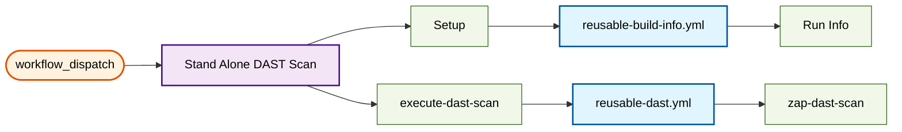

#### Deploy Security Scan Storage

Manual execution of `deploy-security-scan-storage.yml`

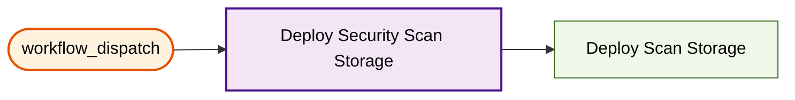

#### Stand Alone E2E Test Runs

Manual execution of `e2e-test.yml`

```mermaid
flowchart LR
    trigger_workflow_dispatch(["workflow_dispatch"])
    e2e_test_yml["Stand Alone E2E Test Runs"]
    e2e_test_yml_setup["Setup"]
    reusable_build_info_yml["reusable-build-info.yml"]
    reusable_build_info_yml_build_info["Run Info"]
    e2e_test_yml_execute_e2e_test["execute-e2e-test"]
    reusable_e2e_yml["reusable-e2e.yml"]
    reusable_e2e_yml_playwright_e2e_test["playwright-e2e-test"]

    trigger_workflow_dispatch --> e2e_test_yml
    e2e_test_yml --> e2e_test_yml_setup
    reusable_build_info_yml --> reusable_build_info_yml_build_info
    e2e_test_yml_setup --> reusable_build_info_yml
    e2e_test_yml --> e2e_test_yml_execute_e2e_test
    reusable_e2e_yml --> reusable_e2e_yml_playwright_e2e_test
    e2e_test_yml_execute_e2e_test --> reusable_e2e_yml

    classDef reusable fill:#e1f5fe,stroke:#01579b,stroke-width:2px,color:#000000
    classDef mainWorkflow fill:#f3e5f5,stroke:#4a148c,stroke-width:2px,color:#000000
    classDef trigger fill:#fff3e0,stroke:#e65100,stroke-width:2px,color:#000000
    classDef job fill:#f1f8e9,stroke:#33691e,stroke-width:1px,color:#000000

    class trigger_workflow_dispatch trigger
    class e2e_test_yml mainWorkflow
    class e2e_test_yml_setup job
    class reusable_build_info_yml reusable
    class reusable_build_info_yml_build_info job
    class e2e_test_yml_execute_e2e_test job
    class reusable_e2e_yml reusable
    class reusable_e2e_yml_playwright_e2e_test job
```

#### NPM Package Updates

Manual execution of `update-dependencies.yml`

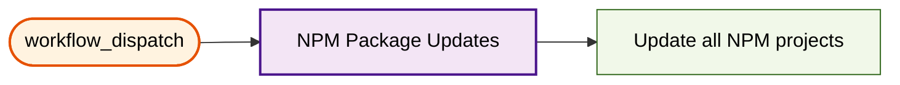

### Workflow_run Triggered Workflows

Workflows triggered by `workflow_run`:
- **slack-notification** (`slack-notification.yml`)

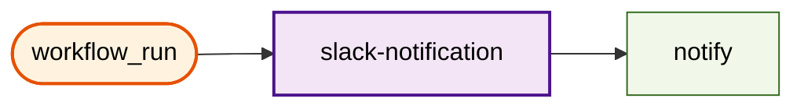

## Overview: All Triggers and Main Workflows

```mermaid
flowchart LR
    trigger_workflow_call(["workflow_call"])
    sub_security_scan_yml["Security"]
    trigger_workflow_dispatch(["workflow_dispatch"])
    deploy_security_scan_storage_yml["Deploy Security Scan Storage"]
    e2e_test_yml["Stand Alone E2E Test Runs"]
    azure_remove_branch_yml["Clean up Flexion Azure Resources"]
    continuous_deployment_yml["Continuous Deployment"]
    build_azure_cli_image_yml["Build Custom Azure CLI Runner Image"]
    dast_scan_yml["Stand Alone DAST Scan"]
    update_dependencies_yml["NPM Package Updates"]
    trigger_delete(["delete"])
    azure_remove_branch_yml["Clean up Flexion Azure Resources"]
    trigger_push(["push"])
    continuous_deployment_yml["Continuous Deployment"]
    trigger_schedule(["schedule"])
    build_azure_cli_image_yml["Build Custom Azure CLI Runner Image"]
    dast_scan_yml["Stand Alone DAST Scan"]
    trigger_workflow_run(["workflow_run"])
    slack_notification_yml["slack-notification"]

    trigger_workflow_call --> sub_security_scan_yml
    trigger_workflow_dispatch --> deploy_security_scan_storage_yml
    trigger_workflow_dispatch --> e2e_test_yml
    trigger_workflow_dispatch --> azure_remove_branch_yml
    trigger_workflow_dispatch --> continuous_deployment_yml
    trigger_workflow_dispatch --> build_azure_cli_image_yml
    trigger_workflow_dispatch --> dast_scan_yml
    trigger_workflow_dispatch --> update_dependencies_yml
    trigger_delete --> azure_remove_branch_yml
    trigger_push --> continuous_deployment_yml
    trigger_schedule --> build_azure_cli_image_yml
    trigger_schedule --> dast_scan_yml
    trigger_workflow_run --> slack_notification_yml

    classDef mainWorkflow fill:#f3e5f5,stroke:#4a148c,stroke-width:2px,color:#000000
    classDef trigger fill:#fff3e0,stroke:#e65100,stroke-width:2px,color:#000000

    class trigger_workflow_call trigger
    class trigger_workflow_dispatch trigger
    class trigger_delete trigger
    class trigger_push trigger
    class trigger_schedule trigger
    class trigger_workflow_run trigger
    class sub_security_scan_yml mainWorkflow
    class deploy_security_scan_storage_yml mainWorkflow
    class e2e_test_yml mainWorkflow
    class azure_remove_branch_yml mainWorkflow
    class continuous_deployment_yml mainWorkflow
    class build_azure_cli_image_yml mainWorkflow
    class dast_scan_yml mainWorkflow
    class update_dependencies_yml mainWorkflow
    class slack_notification_yml mainWorkflow
```

## Workflow Details

### Main Workflows
- **Security** (`sub-security-scan.yml`)
  - Triggers: workflow_call
  - Jobs: 2
- **Deploy Security Scan Storage** (`deploy-security-scan-storage.yml`)
  - Triggers: workflow_dispatch
  - Jobs: 1
- **Stand Alone E2E Test Runs** (`e2e-test.yml`)
  - Triggers: workflow_dispatch
  - Jobs: 2
- **Clean up Flexion Azure Resources** (`azure-remove-branch.yml`)
  - Triggers: delete, workflow_dispatch
  - Jobs: 3
- **Continuous Deployment** (`continuous-deployment.yml`)
  - Triggers: push, workflow_dispatch
  - Jobs: 9
- **Build Custom Azure CLI Runner Image** (`build-azure-cli-image.yml`)
  - Triggers: schedule, workflow_dispatch
  - Jobs: 1
- **Stand Alone DAST Scan** (`dast-scan.yml`)
  - Triggers: schedule, workflow_dispatch
  - Jobs: 2
- **NPM Package Updates** (`update-dependencies.yml`)
  - Triggers: workflow_dispatch
  - Jobs: 1
- **slack-notification** (`slack-notification.yml`)
  - Triggers: workflow_run
  - Jobs: 1

### Reusable Workflows
- **Provision and Configure Cloud Resources** (`sub-deploy.yml`)
  - Jobs: 3
- **Azure Deployment - Supporting Infrastructure** (`reusable-infrastructure-deploy.yml`)
  - Jobs: 2
- **End-to-end Tests** (`reusable-e2e.yml`)
  - Jobs: 1
- **Deploy code for slot** (`sub-deploy-code-slot.yml`)
  - Jobs: 11
- **Endpoint Tests** (`reusable-endpoint-test.yml`)
  - Jobs: 1
- **Azure Deployment - Infrastructure** (`reusable-deploy.yml`)
  - Jobs: 1
- **End-to-end Tests** (`reusable-accessibility.yml`)
  - Jobs: 1
- **Deploy code** (`sub-deploy-code.yml`)
  - Jobs: 5
- **Execute Node Project Unit Tests** (`reusable-unit-test.yml`)
  - Jobs: 1
- **Build Frontend** (`reusable-build-frontend.yml`)
  - Jobs: 1
- **Build** (`sub-build.yml`)
  - Jobs: 3
- **Build Info** (`reusable-build-info.yml`)
  - Jobs: 1
- **DAST Scan** (`reusable-dast.yml`)
  - Jobs: 1
