# GitHub Actions Workflow Analysis

## Summary
- **Total Workflows**: 24
- **Main Workflows**: 10
- **Reusable Workflows**: 14

## Legend

The diagrams use color coding to distinguish different types of workflow components:

**Triggers** - Event triggers that start workflows:
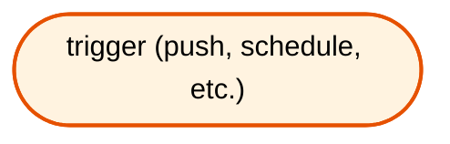

**Main Workflows** - Primary workflow files that can be triggered directly:
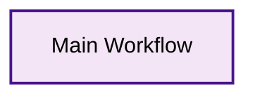

**Reusable Workflows** - Workflow files that are called by other workflows:
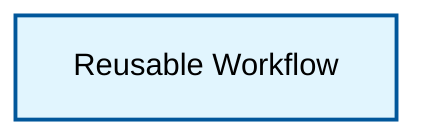

**Jobs** - Individual jobs within workflows showing internal dependencies:

## Workflow Flow Diagrams by Trigger

### Delete Triggered Workflows

Workflows triggered by `delete`:
- **Clean up Flexion Azure Resources** (`azure-remove-branch.yml`)

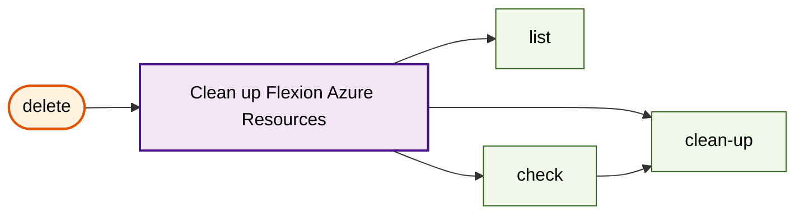

### Push Triggered Workflows

Workflows triggered by `push`:
- **Continuous Deployment** (`continuous-deployment.yml`)

```mermaid
flowchart LR
    trigger_push(["push"])
    continuous_deployment_yml["Continuous Deployment"]
    continuous_deployment_yml_setup["Setup"]
    continuous_deployment_yml_accessibility_test["accessibility-test"]
    continuous_deployment_yml_unit_test_frontend["unit-test-frontend"]
    continuous_deployment_yml_unit_test_backend["unit-test-backend"]
    continuous_deployment_yml_unit_test_common["unit-test-common"]
    continuous_deployment_yml_security_scan["Security"]
    continuous_deployment_yml_build["Build"]
    continuous_deployment_yml_deploy["Cloud Resource Deployment"]
    continuous_deployment_yml_deploy_code_slot["Slot Code Deployment"]
    reusable_reusable_build_info_yml["Build Info<br/>(Reusable)"]
    reusable_reusable_build_info_yml_build_info["Run Info"]
    reusable_reusable_accessibility_yml["End-to-end Tests<br/>(Reusable)"]
    reusable_reusable_accessibility_yml_pa11y_accessibility_test["pa11y-accessibility-test"]
    reusable_reusable_accessibility_yml_playwright_accessibility_test["playwright-accessibility-test"]
    reusable_reusable_unit_test_yml["Execute Node Project Unit Tests<br/>(Reusable)"]
    reusable_reusable_unit_test_yml_unit_test["Unit test ${{ inputs.path }}"]
    reusable_reusable_unit_test_yml_unit_test["Unit test ${{ inputs.path }}"]
    reusable_reusable_unit_test_yml_unit_test["Unit test ${{ inputs.path }}"]
    reusable_sub_build_yml["Build<br/>(Reusable)"]
    reusable_sub_build_yml_see_slot_name["see-slot-name"]
    reusable_sub_build_yml_build_frontend_predeployment["Build Frontend Predeployment"]
    reusable_sub_build_yml_backend["backend"]
    reusable_reusable_build_frontend_yml["Build Frontend<br/>(Reusable)"]
    reusable_reusable_build_frontend_yml_build_frontend["build-frontend"]
    reusable_sub_deploy_yml["Provision and Configure Cloud Resources<br/>(Reusable)"]
    reusable_sub_deploy_yml_deploy_infra["Azure Infrastructure"]
    reusable_sub_deploy_yml_build_frontend_deployment_artifact["Build Frontend for deployment"]
    reusable_sub_deploy_yml_deploy_db["CosmosDb"]
    reusable_reusable_deploy_yml["Azure Deployment - Infrastructure<br/>(Reusable)"]
    reusable_reusable_deploy_yml_deploy_azure_infrastructure["deploy-azure-infrastructure"]
    reusable_reusable_build_frontend_yml_build_frontend["build-frontend"]
    reusable_reusable_database_deploy_yml["Azure Deployment - CosmosDB<br/>(Reusable)"]
    reusable_reusable_database_deploy_yml_deploy_db["deploy-db"]
    reusable_sub_deploy_code_slot_yml["Deploy code for slot<br/>(Reusable)"]
    reusable_sub_deploy_code_slot_yml_deploy_code["Slot Code Deployment"]
    reusable_sub_deploy_code_slot_yml_deploy_webapp_slot["deploy-webapp-slot"]
    reusable_sub_deploy_code_slot_yml_deploy_api_slot["deploy-api-slot"]
    reusable_sub_deploy_code_slot_yml_deploy_dataflows_slot["deploy-dataflows-slot"]
    reusable_sub_deploy_code_slot_yml_endpoint_test_application_slot["endpoint-test-application-slot"]
    reusable_sub_deploy_code_slot_yml_execute_e2e_test["execute-e2e-test"]
    reusable_sub_deploy_code_slot_yml_swap_webapp_deployment_slot["swap-webapp-deployment-slot"]
    reusable_sub_deploy_code_slot_yml_swap_nodeapi_deployment_slot["swap-nodeapi-deployment-slot"]
    reusable_sub_deploy_code_slot_yml_swap_dataflows_app_deployment_slot["swap-dataflows-app-deployment-slot"]
    reusable_sub_deploy_code_slot_yml_endpoint_test_application_post_swap["endpoint-test-application-post-swap"]
    reusable_sub_deploy_code_slot_yml_enable_access["enable-access"]
    reusable_sub_deploy_code_yml["Deploy code<br/>(Reusable)"]
    reusable_sub_deploy_code_yml_deploy_webapp["deploy-webapp"]
    reusable_sub_deploy_code_yml_deploy_api["deploy-api"]
    reusable_sub_deploy_code_yml_deploy_dataflows_app["deploy-dataflows-app"]
    reusable_sub_deploy_code_yml_endpoint_test_application["endpoint-test-application"]
    reusable_sub_deploy_code_yml_enable_access["enable-access"]
    reusable_reusable_endpoint_test_yml["Endpoint Tests<br/>(Reusable)"]
    reusable_reusable_endpoint_test_yml_endpoint_test_application["endpoint-test-application"]
    reusable_reusable_endpoint_test_yml_endpoint_test_application["endpoint-test-application"]
    reusable_reusable_e2e_yml["End-to-end Tests<br/>(Reusable)"]
    reusable_reusable_e2e_yml_playwright_e2e_test["playwright-e2e-test"]
    reusable_reusable_endpoint_test_yml_endpoint_test_application["endpoint-test-application"]

    trigger_push --> continuous_deployment_yml
    continuous_deployment_yml --> continuous_deployment_yml_setup
    continuous_deployment_yml --> continuous_deployment_yml_accessibility_test
    continuous_deployment_yml --> continuous_deployment_yml_unit_test_frontend
    continuous_deployment_yml --> continuous_deployment_yml_unit_test_backend
    continuous_deployment_yml --> continuous_deployment_yml_unit_test_common
    continuous_deployment_yml --> continuous_deployment_yml_security_scan
    continuous_deployment_yml --> continuous_deployment_yml_build
    continuous_deployment_yml --> continuous_deployment_yml_deploy
    continuous_deployment_yml --> continuous_deployment_yml_deploy_code_slot
    continuous_deployment_yml_setup --> reusable_reusable_build_info_yml
    reusable_reusable_build_info_yml --> reusable_reusable_build_info_yml_build_info
    continuous_deployment_yml_accessibility_test --> reusable_reusable_accessibility_yml
    reusable_reusable_accessibility_yml --> reusable_reusable_accessibility_yml_pa11y_accessibility_test
    reusable_reusable_accessibility_yml --> reusable_reusable_accessibility_yml_playwright_accessibility_test
    continuous_deployment_yml_unit_test_frontend --> reusable_reusable_unit_test_yml
    reusable_reusable_unit_test_yml --> reusable_reusable_unit_test_yml_unit_test
    continuous_deployment_yml_unit_test_backend --> reusable_reusable_unit_test_yml
    continuous_deployment_yml_unit_test_common --> reusable_reusable_unit_test_yml
    continuous_deployment_yml_setup --> continuous_deployment_yml_build
    continuous_deployment_yml_build --> reusable_sub_build_yml
    reusable_sub_build_yml --> reusable_sub_build_yml_see_slot_name
    reusable_sub_build_yml --> reusable_sub_build_yml_build_frontend_predeployment
    reusable_sub_build_yml --> reusable_sub_build_yml_backend
    reusable_sub_build_yml_build_frontend_predeployment --> reusable_reusable_build_frontend_yml
    reusable_reusable_build_frontend_yml --> reusable_reusable_build_frontend_yml_build_frontend
    continuous_deployment_yml_deploy --> reusable_sub_deploy_yml
    reusable_sub_deploy_yml --> reusable_sub_deploy_yml_deploy_infra
    reusable_sub_deploy_yml --> reusable_sub_deploy_yml_build_frontend_deployment_artifact
    reusable_sub_deploy_yml --> reusable_sub_deploy_yml_deploy_db
    reusable_sub_deploy_yml_deploy_infra --> reusable_reusable_deploy_yml
    reusable_reusable_deploy_yml --> reusable_reusable_deploy_yml_deploy_azure_infrastructure
    reusable_sub_deploy_yml_deploy_infra --> reusable_sub_deploy_yml_build_frontend_deployment_artifact
    reusable_sub_deploy_yml_build_frontend_deployment_artifact --> reusable_reusable_build_frontend_yml
    reusable_sub_deploy_yml_deploy_infra --> reusable_sub_deploy_yml_deploy_db
    reusable_sub_deploy_yml_deploy_db --> reusable_reusable_database_deploy_yml
    reusable_reusable_database_deploy_yml --> reusable_reusable_database_deploy_yml_deploy_db
    continuous_deployment_yml_setup --> continuous_deployment_yml_deploy_code_slot
    continuous_deployment_yml_deploy --> continuous_deployment_yml_deploy_code_slot
    continuous_deployment_yml_deploy_code_slot --> reusable_sub_deploy_code_slot_yml
    reusable_sub_deploy_code_slot_yml --> reusable_sub_deploy_code_slot_yml_deploy_code
    reusable_sub_deploy_code_slot_yml --> reusable_sub_deploy_code_slot_yml_deploy_webapp_slot
    reusable_sub_deploy_code_slot_yml --> reusable_sub_deploy_code_slot_yml_deploy_api_slot
    reusable_sub_deploy_code_slot_yml --> reusable_sub_deploy_code_slot_yml_deploy_dataflows_slot
    reusable_sub_deploy_code_slot_yml --> reusable_sub_deploy_code_slot_yml_endpoint_test_application_slot
    reusable_sub_deploy_code_slot_yml --> reusable_sub_deploy_code_slot_yml_execute_e2e_test
    reusable_sub_deploy_code_slot_yml --> reusable_sub_deploy_code_slot_yml_swap_webapp_deployment_slot
    reusable_sub_deploy_code_slot_yml --> reusable_sub_deploy_code_slot_yml_swap_nodeapi_deployment_slot
    reusable_sub_deploy_code_slot_yml --> reusable_sub_deploy_code_slot_yml_swap_dataflows_app_deployment_slot
    reusable_sub_deploy_code_slot_yml --> reusable_sub_deploy_code_slot_yml_endpoint_test_application_post_swap
    reusable_sub_deploy_code_slot_yml --> reusable_sub_deploy_code_slot_yml_enable_access
    reusable_sub_deploy_code_slot_yml_deploy_code --> reusable_sub_deploy_code_yml
    reusable_sub_deploy_code_yml --> reusable_sub_deploy_code_yml_deploy_webapp
    reusable_sub_deploy_code_yml --> reusable_sub_deploy_code_yml_deploy_api
    reusable_sub_deploy_code_yml --> reusable_sub_deploy_code_yml_deploy_dataflows_app
    reusable_sub_deploy_code_yml --> reusable_sub_deploy_code_yml_endpoint_test_application
    reusable_sub_deploy_code_yml --> reusable_sub_deploy_code_yml_enable_access
    reusable_sub_deploy_code_yml_deploy_webapp --> reusable_sub_deploy_code_yml_endpoint_test_application
    reusable_sub_deploy_code_yml_deploy_api --> reusable_sub_deploy_code_yml_endpoint_test_application
    reusable_sub_deploy_code_yml_deploy_dataflows_app --> reusable_sub_deploy_code_yml_endpoint_test_application
    reusable_sub_deploy_code_yml_endpoint_test_application --> reusable_reusable_endpoint_test_yml
    reusable_reusable_endpoint_test_yml --> reusable_reusable_endpoint_test_yml_endpoint_test_application
    reusable_sub_deploy_code_yml_endpoint_test_application --> reusable_sub_deploy_code_yml_enable_access
    reusable_sub_deploy_code_slot_yml_deploy_webapp_slot --> reusable_sub_deploy_code_slot_yml_endpoint_test_application_slot
    reusable_sub_deploy_code_slot_yml_deploy_api_slot --> reusable_sub_deploy_code_slot_yml_endpoint_test_application_slot
    reusable_sub_deploy_code_slot_yml_deploy_dataflows_slot --> reusable_sub_deploy_code_slot_yml_endpoint_test_application_slot
    reusable_sub_deploy_code_slot_yml_endpoint_test_application_slot --> reusable_reusable_endpoint_test_yml
    reusable_sub_deploy_code_slot_yml_execute_e2e_test --> reusable_reusable_e2e_yml
    reusable_reusable_e2e_yml --> reusable_reusable_e2e_yml_playwright_e2e_test
    reusable_sub_deploy_code_slot_yml_deploy_webapp_slot --> reusable_sub_deploy_code_slot_yml_swap_webapp_deployment_slot
    reusable_sub_deploy_code_slot_yml_deploy_api_slot --> reusable_sub_deploy_code_slot_yml_swap_webapp_deployment_slot
    reusable_sub_deploy_code_slot_yml_deploy_dataflows_slot --> reusable_sub_deploy_code_slot_yml_swap_webapp_deployment_slot
    reusable_sub_deploy_code_slot_yml_execute_e2e_test --> reusable_sub_deploy_code_slot_yml_swap_webapp_deployment_slot
    reusable_sub_deploy_code_slot_yml_deploy_webapp_slot --> reusable_sub_deploy_code_slot_yml_swap_nodeapi_deployment_slot
    reusable_sub_deploy_code_slot_yml_deploy_api_slot --> reusable_sub_deploy_code_slot_yml_swap_nodeapi_deployment_slot
    reusable_sub_deploy_code_slot_yml_deploy_dataflows_slot --> reusable_sub_deploy_code_slot_yml_swap_nodeapi_deployment_slot
    reusable_sub_deploy_code_slot_yml_execute_e2e_test --> reusable_sub_deploy_code_slot_yml_swap_nodeapi_deployment_slot
    reusable_sub_deploy_code_slot_yml_deploy_webapp_slot --> reusable_sub_deploy_code_slot_yml_swap_dataflows_app_deployment_slot
    reusable_sub_deploy_code_slot_yml_deploy_api_slot --> reusable_sub_deploy_code_slot_yml_swap_dataflows_app_deployment_slot
    reusable_sub_deploy_code_slot_yml_deploy_dataflows_slot --> reusable_sub_deploy_code_slot_yml_swap_dataflows_app_deployment_slot
    reusable_sub_deploy_code_slot_yml_execute_e2e_test --> reusable_sub_deploy_code_slot_yml_swap_dataflows_app_deployment_slot
    reusable_sub_deploy_code_slot_yml_endpoint_test_application_post_swap --> reusable_reusable_endpoint_test_yml
    reusable_sub_deploy_code_slot_yml_endpoint_test_application_post_swap --> reusable_sub_deploy_code_slot_yml_enable_access

    classDef reusable fill:#e1f5fe,stroke:#01579b,stroke-width:2px,color:#000000
    classDef mainWorkflow fill:#f3e5f5,stroke:#4a148c,stroke-width:2px,color:#000000
    classDef trigger fill:#fff3e0,stroke:#e65100,stroke-width:2px,color:#000000
    classDef job fill:#f1f8e9,stroke:#33691e,stroke-width:1px,color:#000000

    class trigger_push trigger
    class continuous_deployment_yml mainWorkflow
    class continuous_deployment_yml_setup job
    class continuous_deployment_yml_accessibility_test job
    class continuous_deployment_yml_unit_test_frontend job
    class continuous_deployment_yml_unit_test_backend job
    class continuous_deployment_yml_unit_test_common job
    class continuous_deployment_yml_security_scan job
    class continuous_deployment_yml_build job
    class continuous_deployment_yml_deploy job
    class continuous_deployment_yml_deploy_code_slot job
    class reusable_reusable_build_info_yml reusable
    class reusable_reusable_build_info_yml_build_info job
    class reusable_reusable_accessibility_yml reusable
    class reusable_reusable_accessibility_yml_pa11y_accessibility_test job
    class reusable_reusable_accessibility_yml_playwright_accessibility_test job
    class reusable_reusable_unit_test_yml reusable
    class reusable_reusable_unit_test_yml_unit_test job
    class reusable_reusable_unit_test_yml_unit_test job
    class reusable_reusable_unit_test_yml_unit_test job
    class reusable_sub_build_yml reusable
    class reusable_sub_build_yml_see_slot_name job
    class reusable_sub_build_yml_build_frontend_predeployment job
    class reusable_sub_build_yml_backend job
    class reusable_reusable_build_frontend_yml reusable
    class reusable_reusable_build_frontend_yml_build_frontend job
    class reusable_sub_deploy_yml reusable
    class reusable_sub_deploy_yml_deploy_infra job
    class reusable_sub_deploy_yml_build_frontend_deployment_artifact job
    class reusable_sub_deploy_yml_deploy_db job
    class reusable_reusable_deploy_yml reusable
    class reusable_reusable_deploy_yml_deploy_azure_infrastructure job
    class reusable_reusable_build_frontend_yml_build_frontend job
    class reusable_reusable_database_deploy_yml reusable
    class reusable_reusable_database_deploy_yml_deploy_db job
    class reusable_sub_deploy_code_slot_yml reusable
    class reusable_sub_deploy_code_slot_yml_deploy_code job
    class reusable_sub_deploy_code_slot_yml_deploy_webapp_slot job
    class reusable_sub_deploy_code_slot_yml_deploy_api_slot job
    class reusable_sub_deploy_code_slot_yml_deploy_dataflows_slot job
    class reusable_sub_deploy_code_slot_yml_endpoint_test_application_slot job
    class reusable_sub_deploy_code_slot_yml_execute_e2e_test job
    class reusable_sub_deploy_code_slot_yml_swap_webapp_deployment_slot job
    class reusable_sub_deploy_code_slot_yml_swap_nodeapi_deployment_slot job
    class reusable_sub_deploy_code_slot_yml_swap_dataflows_app_deployment_slot job
    class reusable_sub_deploy_code_slot_yml_endpoint_test_application_post_swap job
    class reusable_sub_deploy_code_slot_yml_enable_access job
    class reusable_sub_deploy_code_yml reusable
    class reusable_sub_deploy_code_yml_deploy_webapp job
    class reusable_sub_deploy_code_yml_deploy_api job
    class reusable_sub_deploy_code_yml_deploy_dataflows_app job
    class reusable_sub_deploy_code_yml_endpoint_test_application job
    class reusable_sub_deploy_code_yml_enable_access job
    class reusable_reusable_endpoint_test_yml reusable
    class reusable_reusable_endpoint_test_yml_endpoint_test_application job
    class reusable_reusable_endpoint_test_yml_endpoint_test_application job
    class reusable_reusable_e2e_yml reusable
    class reusable_reusable_e2e_yml_playwright_e2e_test job
    class reusable_reusable_endpoint_test_yml_endpoint_test_application job
```

### Schedule Triggered Workflows

Workflows triggered by `schedule`:
- **Build Custom Azure CLI Runner Image** (`build-azure-cli-image.yml`)
- **Stand Alone DAST Scan** (`dast-scan.yml`)
- **NPM Package Updates** (`update-dependencies.yml`)
- **Veracode Dynamic Analysis Scan** (`veracode-dast-scan.yml`)
- **Veracode Static Analysis Scan** (`veracode-sast-upload.yml`)

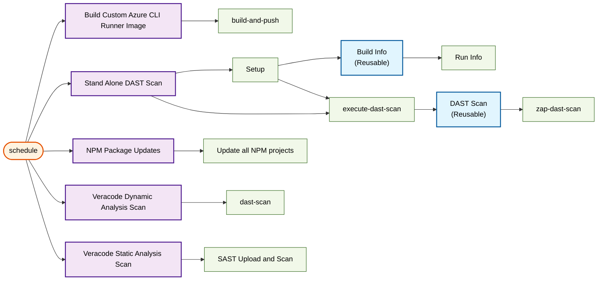

### Workflow_call Triggered Workflows

Workflows triggered by `workflow_call`:
- **Veracode Security** (`sub-security-scan.yml`)

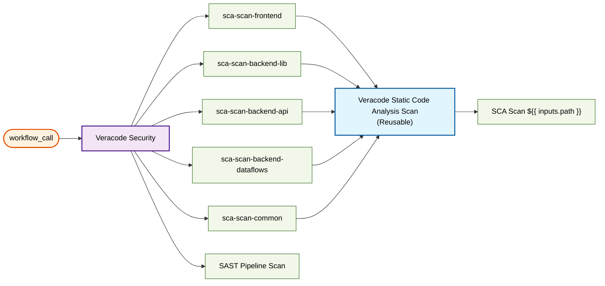

### Workflow_dispatch Triggered Workflows

The `workflow_dispatch` trigger allows manual execution of workflows. Each workflow is shown individually below:

#### Clean up Flexion Azure Resources

Manual execution of `azure-remove-branch.yml`

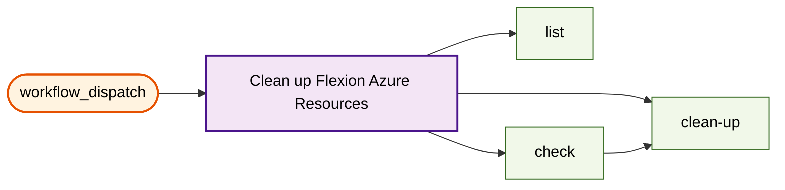

#### Build Custom Azure CLI Runner Image

Manual execution of `build-azure-cli-image.yml`

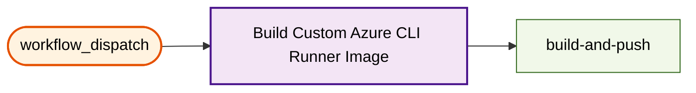

#### Continuous Deployment

Manual execution of `continuous-deployment.yml`

```mermaid
flowchart LR
    trigger_workflow_dispatch(["workflow_dispatch"])
    continuous_deployment_yml["Continuous Deployment"]
    continuous_deployment_yml_setup["Setup"]
    continuous_deployment_yml_accessibility_test["accessibility-test"]
    continuous_deployment_yml_unit_test_frontend["unit-test-frontend"]
    continuous_deployment_yml_unit_test_backend["unit-test-backend"]
    continuous_deployment_yml_unit_test_common["unit-test-common"]
    continuous_deployment_yml_security_scan["Security"]
    continuous_deployment_yml_build["Build"]
    continuous_deployment_yml_deploy["Cloud Resource Deployment"]
    continuous_deployment_yml_deploy_code_slot["Slot Code Deployment"]
    reusable_reusable_build_info_yml["Build Info<br/>(Reusable)"]
    reusable_reusable_build_info_yml_build_info["Run Info"]
    reusable_reusable_accessibility_yml["End-to-end Tests<br/>(Reusable)"]
    reusable_reusable_accessibility_yml_pa11y_accessibility_test["pa11y-accessibility-test"]
    reusable_reusable_accessibility_yml_playwright_accessibility_test["playwright-accessibility-test"]
    reusable_reusable_unit_test_yml["Execute Node Project Unit Tests<br/>(Reusable)"]
    reusable_reusable_unit_test_yml_unit_test["Unit test ${{ inputs.path }}"]
    reusable_reusable_unit_test_yml_unit_test["Unit test ${{ inputs.path }}"]
    reusable_reusable_unit_test_yml_unit_test["Unit test ${{ inputs.path }}"]
    reusable_sub_build_yml["Build<br/>(Reusable)"]
    reusable_sub_build_yml_see_slot_name["see-slot-name"]
    reusable_sub_build_yml_build_frontend_predeployment["Build Frontend Predeployment"]
    reusable_sub_build_yml_backend["backend"]
    reusable_reusable_build_frontend_yml["Build Frontend<br/>(Reusable)"]
    reusable_reusable_build_frontend_yml_build_frontend["build-frontend"]
    reusable_sub_deploy_yml["Provision and Configure Cloud Resources<br/>(Reusable)"]
    reusable_sub_deploy_yml_deploy_infra["Azure Infrastructure"]
    reusable_sub_deploy_yml_build_frontend_deployment_artifact["Build Frontend for deployment"]
    reusable_sub_deploy_yml_deploy_db["CosmosDb"]
    reusable_reusable_deploy_yml["Azure Deployment - Infrastructure<br/>(Reusable)"]
    reusable_reusable_deploy_yml_deploy_azure_infrastructure["deploy-azure-infrastructure"]
    reusable_reusable_build_frontend_yml_build_frontend["build-frontend"]
    reusable_reusable_database_deploy_yml["Azure Deployment - CosmosDB<br/>(Reusable)"]
    reusable_reusable_database_deploy_yml_deploy_db["deploy-db"]
    reusable_sub_deploy_code_slot_yml["Deploy code for slot<br/>(Reusable)"]
    reusable_sub_deploy_code_slot_yml_deploy_code["Slot Code Deployment"]
    reusable_sub_deploy_code_slot_yml_deploy_webapp_slot["deploy-webapp-slot"]
    reusable_sub_deploy_code_slot_yml_deploy_api_slot["deploy-api-slot"]
    reusable_sub_deploy_code_slot_yml_deploy_dataflows_slot["deploy-dataflows-slot"]
    reusable_sub_deploy_code_slot_yml_endpoint_test_application_slot["endpoint-test-application-slot"]
    reusable_sub_deploy_code_slot_yml_execute_e2e_test["execute-e2e-test"]
    reusable_sub_deploy_code_slot_yml_swap_webapp_deployment_slot["swap-webapp-deployment-slot"]
    reusable_sub_deploy_code_slot_yml_swap_nodeapi_deployment_slot["swap-nodeapi-deployment-slot"]
    reusable_sub_deploy_code_slot_yml_swap_dataflows_app_deployment_slot["swap-dataflows-app-deployment-slot"]
    reusable_sub_deploy_code_slot_yml_endpoint_test_application_post_swap["endpoint-test-application-post-swap"]
    reusable_sub_deploy_code_slot_yml_enable_access["enable-access"]
    reusable_sub_deploy_code_yml["Deploy code<br/>(Reusable)"]
    reusable_sub_deploy_code_yml_deploy_webapp["deploy-webapp"]
    reusable_sub_deploy_code_yml_deploy_api["deploy-api"]
    reusable_sub_deploy_code_yml_deploy_dataflows_app["deploy-dataflows-app"]
    reusable_sub_deploy_code_yml_endpoint_test_application["endpoint-test-application"]
    reusable_sub_deploy_code_yml_enable_access["enable-access"]
    reusable_reusable_endpoint_test_yml["Endpoint Tests<br/>(Reusable)"]
    reusable_reusable_endpoint_test_yml_endpoint_test_application["endpoint-test-application"]
    reusable_reusable_endpoint_test_yml_endpoint_test_application["endpoint-test-application"]
    reusable_reusable_e2e_yml["End-to-end Tests<br/>(Reusable)"]
    reusable_reusable_e2e_yml_playwright_e2e_test["playwright-e2e-test"]
    reusable_reusable_endpoint_test_yml_endpoint_test_application["endpoint-test-application"]

    trigger_workflow_dispatch --> continuous_deployment_yml
    continuous_deployment_yml --> continuous_deployment_yml_setup
    continuous_deployment_yml --> continuous_deployment_yml_accessibility_test
    continuous_deployment_yml --> continuous_deployment_yml_unit_test_frontend
    continuous_deployment_yml --> continuous_deployment_yml_unit_test_backend
    continuous_deployment_yml --> continuous_deployment_yml_unit_test_common
    continuous_deployment_yml --> continuous_deployment_yml_security_scan
    continuous_deployment_yml --> continuous_deployment_yml_build
    continuous_deployment_yml --> continuous_deployment_yml_deploy
    continuous_deployment_yml --> continuous_deployment_yml_deploy_code_slot
    continuous_deployment_yml_setup --> reusable_reusable_build_info_yml
    reusable_reusable_build_info_yml --> reusable_reusable_build_info_yml_build_info
    continuous_deployment_yml_accessibility_test --> reusable_reusable_accessibility_yml
    reusable_reusable_accessibility_yml --> reusable_reusable_accessibility_yml_pa11y_accessibility_test
    reusable_reusable_accessibility_yml --> reusable_reusable_accessibility_yml_playwright_accessibility_test
    continuous_deployment_yml_unit_test_frontend --> reusable_reusable_unit_test_yml
    reusable_reusable_unit_test_yml --> reusable_reusable_unit_test_yml_unit_test
    continuous_deployment_yml_unit_test_backend --> reusable_reusable_unit_test_yml
    continuous_deployment_yml_unit_test_common --> reusable_reusable_unit_test_yml
    continuous_deployment_yml_setup --> continuous_deployment_yml_build
    continuous_deployment_yml_build --> reusable_sub_build_yml
    reusable_sub_build_yml --> reusable_sub_build_yml_see_slot_name
    reusable_sub_build_yml --> reusable_sub_build_yml_build_frontend_predeployment
    reusable_sub_build_yml --> reusable_sub_build_yml_backend
    reusable_sub_build_yml_build_frontend_predeployment --> reusable_reusable_build_frontend_yml
    reusable_reusable_build_frontend_yml --> reusable_reusable_build_frontend_yml_build_frontend
    continuous_deployment_yml_deploy --> reusable_sub_deploy_yml
    reusable_sub_deploy_yml --> reusable_sub_deploy_yml_deploy_infra
    reusable_sub_deploy_yml --> reusable_sub_deploy_yml_build_frontend_deployment_artifact
    reusable_sub_deploy_yml --> reusable_sub_deploy_yml_deploy_db
    reusable_sub_deploy_yml_deploy_infra --> reusable_reusable_deploy_yml
    reusable_reusable_deploy_yml --> reusable_reusable_deploy_yml_deploy_azure_infrastructure
    reusable_sub_deploy_yml_deploy_infra --> reusable_sub_deploy_yml_build_frontend_deployment_artifact
    reusable_sub_deploy_yml_build_frontend_deployment_artifact --> reusable_reusable_build_frontend_yml
    reusable_sub_deploy_yml_deploy_infra --> reusable_sub_deploy_yml_deploy_db
    reusable_sub_deploy_yml_deploy_db --> reusable_reusable_database_deploy_yml
    reusable_reusable_database_deploy_yml --> reusable_reusable_database_deploy_yml_deploy_db
    continuous_deployment_yml_setup --> continuous_deployment_yml_deploy_code_slot
    continuous_deployment_yml_deploy --> continuous_deployment_yml_deploy_code_slot
    continuous_deployment_yml_deploy_code_slot --> reusable_sub_deploy_code_slot_yml
    reusable_sub_deploy_code_slot_yml --> reusable_sub_deploy_code_slot_yml_deploy_code
    reusable_sub_deploy_code_slot_yml --> reusable_sub_deploy_code_slot_yml_deploy_webapp_slot
    reusable_sub_deploy_code_slot_yml --> reusable_sub_deploy_code_slot_yml_deploy_api_slot
    reusable_sub_deploy_code_slot_yml --> reusable_sub_deploy_code_slot_yml_deploy_dataflows_slot
    reusable_sub_deploy_code_slot_yml --> reusable_sub_deploy_code_slot_yml_endpoint_test_application_slot
    reusable_sub_deploy_code_slot_yml --> reusable_sub_deploy_code_slot_yml_execute_e2e_test
    reusable_sub_deploy_code_slot_yml --> reusable_sub_deploy_code_slot_yml_swap_webapp_deployment_slot
    reusable_sub_deploy_code_slot_yml --> reusable_sub_deploy_code_slot_yml_swap_nodeapi_deployment_slot
    reusable_sub_deploy_code_slot_yml --> reusable_sub_deploy_code_slot_yml_swap_dataflows_app_deployment_slot
    reusable_sub_deploy_code_slot_yml --> reusable_sub_deploy_code_slot_yml_endpoint_test_application_post_swap
    reusable_sub_deploy_code_slot_yml --> reusable_sub_deploy_code_slot_yml_enable_access
    reusable_sub_deploy_code_slot_yml_deploy_code --> reusable_sub_deploy_code_yml
    reusable_sub_deploy_code_yml --> reusable_sub_deploy_code_yml_deploy_webapp
    reusable_sub_deploy_code_yml --> reusable_sub_deploy_code_yml_deploy_api
    reusable_sub_deploy_code_yml --> reusable_sub_deploy_code_yml_deploy_dataflows_app
    reusable_sub_deploy_code_yml --> reusable_sub_deploy_code_yml_endpoint_test_application
    reusable_sub_deploy_code_yml --> reusable_sub_deploy_code_yml_enable_access
    reusable_sub_deploy_code_yml_deploy_webapp --> reusable_sub_deploy_code_yml_endpoint_test_application
    reusable_sub_deploy_code_yml_deploy_api --> reusable_sub_deploy_code_yml_endpoint_test_application
    reusable_sub_deploy_code_yml_deploy_dataflows_app --> reusable_sub_deploy_code_yml_endpoint_test_application
    reusable_sub_deploy_code_yml_endpoint_test_application --> reusable_reusable_endpoint_test_yml
    reusable_reusable_endpoint_test_yml --> reusable_reusable_endpoint_test_yml_endpoint_test_application
    reusable_sub_deploy_code_yml_endpoint_test_application --> reusable_sub_deploy_code_yml_enable_access
    reusable_sub_deploy_code_slot_yml_deploy_webapp_slot --> reusable_sub_deploy_code_slot_yml_endpoint_test_application_slot
    reusable_sub_deploy_code_slot_yml_deploy_api_slot --> reusable_sub_deploy_code_slot_yml_endpoint_test_application_slot
    reusable_sub_deploy_code_slot_yml_deploy_dataflows_slot --> reusable_sub_deploy_code_slot_yml_endpoint_test_application_slot
    reusable_sub_deploy_code_slot_yml_endpoint_test_application_slot --> reusable_reusable_endpoint_test_yml
    reusable_sub_deploy_code_slot_yml_execute_e2e_test --> reusable_reusable_e2e_yml
    reusable_reusable_e2e_yml --> reusable_reusable_e2e_yml_playwright_e2e_test
    reusable_sub_deploy_code_slot_yml_deploy_webapp_slot --> reusable_sub_deploy_code_slot_yml_swap_webapp_deployment_slot
    reusable_sub_deploy_code_slot_yml_deploy_api_slot --> reusable_sub_deploy_code_slot_yml_swap_webapp_deployment_slot
    reusable_sub_deploy_code_slot_yml_deploy_dataflows_slot --> reusable_sub_deploy_code_slot_yml_swap_webapp_deployment_slot
    reusable_sub_deploy_code_slot_yml_execute_e2e_test --> reusable_sub_deploy_code_slot_yml_swap_webapp_deployment_slot
    reusable_sub_deploy_code_slot_yml_deploy_webapp_slot --> reusable_sub_deploy_code_slot_yml_swap_nodeapi_deployment_slot
    reusable_sub_deploy_code_slot_yml_deploy_api_slot --> reusable_sub_deploy_code_slot_yml_swap_nodeapi_deployment_slot
    reusable_sub_deploy_code_slot_yml_deploy_dataflows_slot --> reusable_sub_deploy_code_slot_yml_swap_nodeapi_deployment_slot
    reusable_sub_deploy_code_slot_yml_execute_e2e_test --> reusable_sub_deploy_code_slot_yml_swap_nodeapi_deployment_slot
    reusable_sub_deploy_code_slot_yml_deploy_webapp_slot --> reusable_sub_deploy_code_slot_yml_swap_dataflows_app_deployment_slot
    reusable_sub_deploy_code_slot_yml_deploy_api_slot --> reusable_sub_deploy_code_slot_yml_swap_dataflows_app_deployment_slot
    reusable_sub_deploy_code_slot_yml_deploy_dataflows_slot --> reusable_sub_deploy_code_slot_yml_swap_dataflows_app_deployment_slot
    reusable_sub_deploy_code_slot_yml_execute_e2e_test --> reusable_sub_deploy_code_slot_yml_swap_dataflows_app_deployment_slot
    reusable_sub_deploy_code_slot_yml_endpoint_test_application_post_swap --> reusable_reusable_endpoint_test_yml
    reusable_sub_deploy_code_slot_yml_endpoint_test_application_post_swap --> reusable_sub_deploy_code_slot_yml_enable_access

    classDef reusable fill:#e1f5fe,stroke:#01579b,stroke-width:2px,color:#000000
    classDef mainWorkflow fill:#f3e5f5,stroke:#4a148c,stroke-width:2px,color:#000000
    classDef trigger fill:#fff3e0,stroke:#e65100,stroke-width:2px,color:#000000
    classDef job fill:#f1f8e9,stroke:#33691e,stroke-width:1px,color:#000000

    class trigger_workflow_dispatch trigger
    class continuous_deployment_yml mainWorkflow
    class continuous_deployment_yml_setup job
    class continuous_deployment_yml_accessibility_test job
    class continuous_deployment_yml_unit_test_frontend job
    class continuous_deployment_yml_unit_test_backend job
    class continuous_deployment_yml_unit_test_common job
    class continuous_deployment_yml_security_scan job
    class continuous_deployment_yml_build job
    class continuous_deployment_yml_deploy job
    class continuous_deployment_yml_deploy_code_slot job
    class reusable_reusable_build_info_yml reusable
    class reusable_reusable_build_info_yml_build_info job
    class reusable_reusable_accessibility_yml reusable
    class reusable_reusable_accessibility_yml_pa11y_accessibility_test job
    class reusable_reusable_accessibility_yml_playwright_accessibility_test job
    class reusable_reusable_unit_test_yml reusable
    class reusable_reusable_unit_test_yml_unit_test job
    class reusable_reusable_unit_test_yml_unit_test job
    class reusable_reusable_unit_test_yml_unit_test job
    class reusable_sub_build_yml reusable
    class reusable_sub_build_yml_see_slot_name job
    class reusable_sub_build_yml_build_frontend_predeployment job
    class reusable_sub_build_yml_backend job
    class reusable_reusable_build_frontend_yml reusable
    class reusable_reusable_build_frontend_yml_build_frontend job
    class reusable_sub_deploy_yml reusable
    class reusable_sub_deploy_yml_deploy_infra job
    class reusable_sub_deploy_yml_build_frontend_deployment_artifact job
    class reusable_sub_deploy_yml_deploy_db job
    class reusable_reusable_deploy_yml reusable
    class reusable_reusable_deploy_yml_deploy_azure_infrastructure job
    class reusable_reusable_build_frontend_yml_build_frontend job
    class reusable_reusable_database_deploy_yml reusable
    class reusable_reusable_database_deploy_yml_deploy_db job
    class reusable_sub_deploy_code_slot_yml reusable
    class reusable_sub_deploy_code_slot_yml_deploy_code job
    class reusable_sub_deploy_code_slot_yml_deploy_webapp_slot job
    class reusable_sub_deploy_code_slot_yml_deploy_api_slot job
    class reusable_sub_deploy_code_slot_yml_deploy_dataflows_slot job
    class reusable_sub_deploy_code_slot_yml_endpoint_test_application_slot job
    class reusable_sub_deploy_code_slot_yml_execute_e2e_test job
    class reusable_sub_deploy_code_slot_yml_swap_webapp_deployment_slot job
    class reusable_sub_deploy_code_slot_yml_swap_nodeapi_deployment_slot job
    class reusable_sub_deploy_code_slot_yml_swap_dataflows_app_deployment_slot job
    class reusable_sub_deploy_code_slot_yml_endpoint_test_application_post_swap job
    class reusable_sub_deploy_code_slot_yml_enable_access job
    class reusable_sub_deploy_code_yml reusable
    class reusable_sub_deploy_code_yml_deploy_webapp job
    class reusable_sub_deploy_code_yml_deploy_api job
    class reusable_sub_deploy_code_yml_deploy_dataflows_app job
    class reusable_sub_deploy_code_yml_endpoint_test_application job
    class reusable_sub_deploy_code_yml_enable_access job
    class reusable_reusable_endpoint_test_yml reusable
    class reusable_reusable_endpoint_test_yml_endpoint_test_application job
    class reusable_reusable_endpoint_test_yml_endpoint_test_application job
    class reusable_reusable_e2e_yml reusable
    class reusable_reusable_e2e_yml_playwright_e2e_test job
    class reusable_reusable_endpoint_test_yml_endpoint_test_application job
```

#### Stand Alone DAST Scan

Manual execution of `dast-scan.yml`

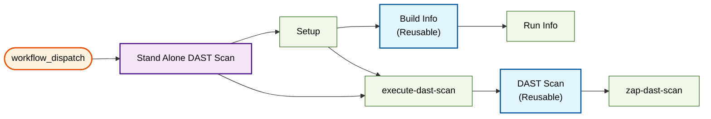

#### Stand Alone E2E Test Runs

Manual execution of `e2e-test.yml`

```mermaid
flowchart LR
    trigger_workflow_dispatch(["workflow_dispatch"])
    e2e_test_yml["Stand Alone E2E Test Runs"]
    e2e_test_yml_setup["Setup"]
    e2e_test_yml_execute_e2e_test["execute-e2e-test"]
    reusable_reusable_build_info_yml["Build Info<br/>(Reusable)"]
    reusable_reusable_build_info_yml_build_info["Run Info"]
    reusable_reusable_e2e_yml["End-to-end Tests<br/>(Reusable)"]
    reusable_reusable_e2e_yml_playwright_e2e_test["playwright-e2e-test"]

    trigger_workflow_dispatch --> e2e_test_yml
    e2e_test_yml --> e2e_test_yml_setup
    e2e_test_yml --> e2e_test_yml_execute_e2e_test
    e2e_test_yml_setup --> reusable_reusable_build_info_yml
    reusable_reusable_build_info_yml --> reusable_reusable_build_info_yml_build_info
    e2e_test_yml_setup --> e2e_test_yml_execute_e2e_test
    e2e_test_yml_execute_e2e_test --> reusable_reusable_e2e_yml
    reusable_reusable_e2e_yml --> reusable_reusable_e2e_yml_playwright_e2e_test

    classDef reusable fill:#e1f5fe,stroke:#01579b,stroke-width:2px,color:#000000
    classDef mainWorkflow fill:#f3e5f5,stroke:#4a148c,stroke-width:2px,color:#000000
    classDef trigger fill:#fff3e0,stroke:#e65100,stroke-width:2px,color:#000000
    classDef job fill:#f1f8e9,stroke:#33691e,stroke-width:1px,color:#000000

    class trigger_workflow_dispatch trigger
    class e2e_test_yml mainWorkflow
    class e2e_test_yml_setup job
    class e2e_test_yml_execute_e2e_test job
    class reusable_reusable_build_info_yml reusable
    class reusable_reusable_build_info_yml_build_info job
    class reusable_reusable_e2e_yml reusable
    class reusable_reusable_e2e_yml_playwright_e2e_test job
```

#### NPM Package Updates

Manual execution of `update-dependencies.yml`

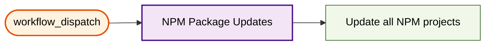

#### Veracode Dynamic Analysis Scan

Manual execution of `veracode-dast-scan.yml`

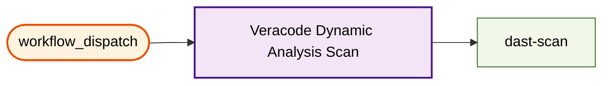

#### Veracode Static Analysis Scan

Manual execution of `veracode-sast-upload.yml`

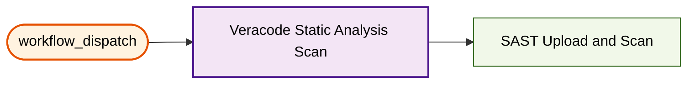

### Workflow_run Triggered Workflows

Workflows triggered by `workflow_run`:
- **slack-notification** (`slack-notification.yml`)

## Overview: All Triggers and Main Workflows

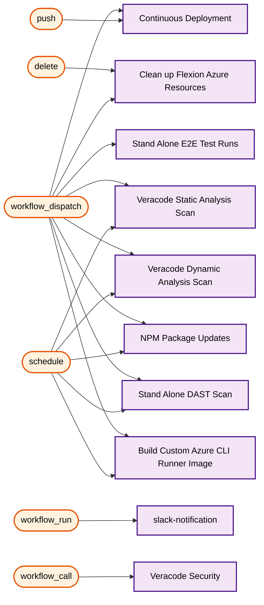

## Workflow Details

### Main Workflows
- **Clean up Flexion Azure Resources** (`azure-remove-branch.yml`)
  - Triggers: delete, workflow_dispatch
  - Jobs: 3
- **Build Custom Azure CLI Runner Image** (`build-azure-cli-image.yml`)
  - Triggers: schedule, workflow_dispatch
  - Jobs: 1
- **Continuous Deployment** (`continuous-deployment.yml`)
  - Triggers: push, workflow_dispatch
  - Jobs: 9
- **Stand Alone DAST Scan** (`dast-scan.yml`)
  - Triggers: schedule, workflow_dispatch
  - Jobs: 2
- **Stand Alone E2E Test Runs** (`e2e-test.yml`)
  - Triggers: workflow_dispatch
  - Jobs: 2
- **slack-notification** (`slack-notification.yml`)
  - Triggers: workflow_run
  - Jobs: 1
- **Veracode Security** (`sub-security-scan.yml`)
  - Triggers: workflow_call
  - Jobs: 6
- **NPM Package Updates** (`update-dependencies.yml`)
  - Triggers: schedule, workflow_dispatch
  - Jobs: 1
- **Veracode Dynamic Analysis Scan** (`veracode-dast-scan.yml`)
  - Triggers: schedule, workflow_dispatch
  - Jobs: 1
- **Veracode Static Analysis Scan** (`veracode-sast-upload.yml`)
  - Triggers: schedule, workflow_dispatch
  - Jobs: 1

### Reusable Workflows
- **End-to-end Tests** (`reusable-accessibility.yml`)
  - Jobs: 2
- **Build Frontend** (`reusable-build-frontend.yml`)
  - Jobs: 1
- **Build Info** (`reusable-build-info.yml`)
  - Jobs: 1
- **DAST Scan** (`reusable-dast.yml`)
  - Jobs: 1
- **Azure Deployment - CosmosDB** (`reusable-database-deploy.yml`)
  - Jobs: 1
- **Azure Deployment - Infrastructure** (`reusable-deploy.yml`)
  - Jobs: 1
- **End-to-end Tests** (`reusable-e2e.yml`)
  - Jobs: 1
- **Endpoint Tests** (`reusable-endpoint-test.yml`)
  - Jobs: 1
- **Veracode Static Code Analysis Scan** (`reusable-sca-scan.yml`)
  - Jobs: 1
- **Execute Node Project Unit Tests** (`reusable-unit-test.yml`)
  - Jobs: 1
- **Build** (`sub-build.yml`)
  - Jobs: 3
- **Deploy code for slot** (`sub-deploy-code-slot.yml`)
  - Jobs: 11
- **Deploy code** (`sub-deploy-code.yml`)
  - Jobs: 5
- **Provision and Configure Cloud Resources** (`sub-deploy.yml`)
  - Jobs: 3
